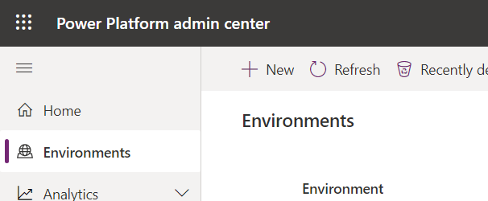
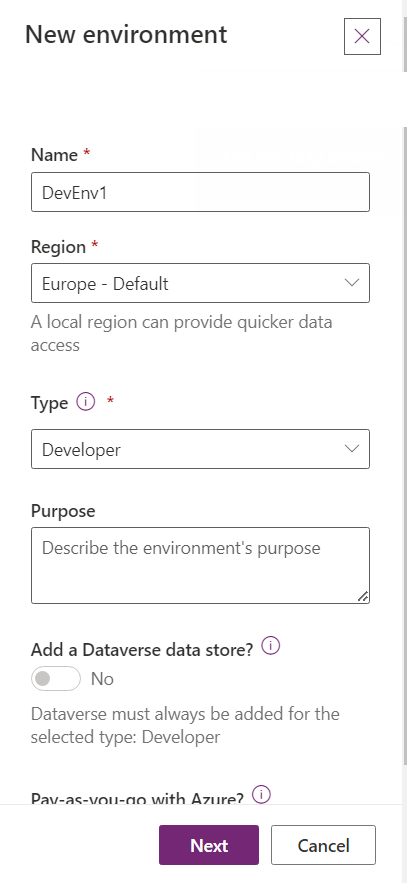
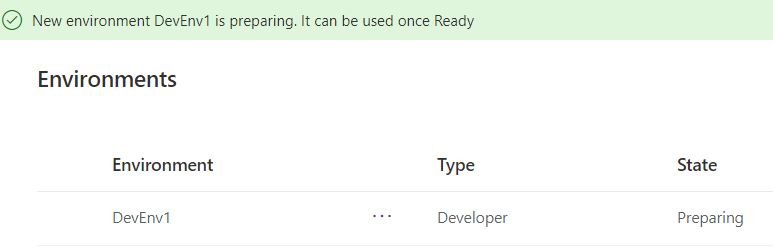

# Lab 01: Develop a Coffee Machine Ordering Power Apps Canvas App - Virtual Lab
=============================================================

*   Lab Overview
*  4 Units

## Lab Overview

In this lab, you'll kick off your journey with Microsoft's Power Platform, specifically by crafting a canvas app. This canvas app is designed to streamline the coffee machine ordering process for various Contoso offices. Subsequent units will delve into data modeling, the construction of a model-driven app, and the incorporation of automation features using Power Automate cloud flows for approvals.

## Learning Objectives
-------------

In this lab, you'll learn to:

* Craft a canvas app
* Introduce multiple screens to your app
* Utilize Power Fx formulas within your application
* Implement screen navigation
* Personalize galleries within the app screens
* Create a data collection within the app

Introduction
============

This lab has three exercises:

**Exercise 1** - Create the app in Microsoft Power Apps. In this exercise, you'll create a solution to hold your app and any related customizations. Then, you'll create your canvas app and complete the first screen of the app.

**Exercise 2** - Add a machine gallery and connect to a data source. In this exercise, you'll add a gallery of all available machines, which will help make it easier for users to browse the list and get a quick overview of the available machines.

**Exercise 3** - Add a compare screen. The second screen is where users compare the selected machines and then choose the one that they want to submit for approval.

Coffee Machine Ordering Scenario
--------------------------------

Imagine an organization where every few years the employees request an updated coffee machine for their employee break room. The organization would like to build a customized app that runs on the web and mobile devices, which will help streamline the machine order and approval process. Moreover, they don't have traditional development resources available, such as a .NET, Xamarin or custom website developer, to create this application.

Solution overview
-----------------

The Microsoft Power Platform technologies enable tech-savvy business users to build a customized machine ordering solution. The application user interface and interaction logic are built in Power Apps, the approval workflow is automated using Power Automate, and the machine order data is stored in Microsoft Dataverse.

Key features of the solution
----------------------------

*   Ability to browse through a selection of coffee machines
*   Select machines to compare
*   View detailed specs for the selected machines on a second comparison screen
*   Select a machine to order
*   Enter order details into a customized form, including an image
*   By default, have the approver set to the logged in user’s manager
*   Capture other default properties, such as the date of the request
*   Store machine orders in a secure and scalable Cloud database
*   Enable an admin to view all machine orders
*   Follow a customized procurement process to place purchase orders for machines
*   Send an automated approval request email when the order is placed
*   Allow the approver to approve or reject an order and add comments without leaving their email inbox
*   View all sent and received approval requests on the web and mobile
*   Notify the user via email when their order is approved or rejected

Notes
-----------------
#### If you have already created the environment in the previous "Build a simple app" session, move on to the next lab in this series.

- **If you were not part of the previous sessions, follow these steps.**

Sign in to Power Platform
 

1.  Open a web browser and navigate to https://admin.powerplatform.microsoft.com/environments

2.  Sign in using the Microsoft account provided to use
    for this training

3.  Once signed in, click on \"Environments\" in the left navigation menu.

4. Setup a new environment

5. From the left navigation panel, click on *`Environments`*

6. From the top toolbar, select *`+ New`*

7. Fill in the fields as follow:
   - **Name**: `DevEnv1`
   - **Region**: `Europe`
   - **Type**: `Developer`

8. Click *`Next`*
9. Set the **Currency** to `USD ($)`
10. Click *`Save`*

11. In the list of environments, your **DevEnv1** environment should now
show as **Preparing**.

Your practice environment will take a few minutes to provision.
Refresh the **Environments** list if needed.

12. When your environment shows as **Ready**, you are good to go!
   
    
    Important
    
    You need to wait for the database to finish provisioning before trying to create an application. The **Status** will change to **Ready** when done.
    
13. This may take few minutes to complete. Wait for it to complete before proceeding with creating an app. If it has been over three minutes, try refreshing the browser. Once the database has been created, you should no longer see the **Preparing Instance** message. You can then proceed with the lab.
