Exercise - Add a machine gallery and connect to the data source
===============================================================


In this exercise, you add a gallery of all available machines to help make it easier for users to browse the list and get a quick overview of the available machines.

Note

To complete the exercises, you'll need to use a few files. Download the [Student files](https://github.com/MicrosoftDocs/mslearn-developer-tools-power-platform/raw/master/in-a-day/AIAD/AppinADayStudentFiles.zip) for use in this lab.

Task: Add a machine type gallery
--------------------------------

In this task, you add a gallery that lists the machine types. This gallery is a single-column, vertical gallery down the left side of the screen, with each cell displaying an image of the machine type. You use this gallery later as a filter for the machine gallery that you create.

1.  Select the **Main Screen**.
    
2.  Select **\+ Insert**, expand the **Layout** group, and then select **Vertical gallery**.
    
    [](media/insert-vertical-gallery.png#lightbox)
    
    This action adds a gallery called **Gallery1** on the screen. The control tree view on the left will display this gallery with three controls within it: two labels and an image. A data pane appears on the right. If the data pane  disappeared, delete the gallery from the tree view and insert it again.
    
    [](media/gallery.png#lightbox)
    
3.  Expand **Connectors** and then select **See all connectors**.
    
    [](media/show-all-connectors.png#lightbox)
    
4.  Select **Import from Excel**.
    
    [](media/import-from-excel.png#lightbox)
    
5.  In the **File Open** dialog, browse to the location where you unzipped the data file (for example ://Downloads/) and then select [**Machine-Order-Data.xlsx**](https://github.com/MicrosoftDocs/mslearn-developer-tools-power-platform/raw/master/in-a-day/AIAD/AppinADayStudentFiles.zip) to load it.
    
    [](media/open.png#lightbox)
    
6.  Select the **Machines** and **MachineTypes** tables and then select the **Connect** button. Now, both tables are added as static data into the application.
    
    [](media/connect.png#lightbox)
    
    Note
    
    In this lab, you'll work with tables that are imported from a static data file and embedded as resources in the app. If you were building a real solution, the same tables would likely be stored in the cloud, such as in a SharePoint list, a SQL table, or a Microsoft Dataverse table.
    
7.  Rename the gallery as `Machine Type Gallery`.
    
    [](media/rename-gallery.png#lightbox)
    

### Work with galleries

Galleries provide a powerful way to visualize tabular data in Power Apps. It's important that you become familiar with customizing a gallery. Key components of a gallery are the gallery control, the template cell (first cell), and controls within the template cell.

To select the entire gallery, select the gallery in the tree view on the left or select the second or third cell. Selecting any cell that isn't the first cell of the gallery selects the entire gallery. Now, you can specify properties that apply to the entire gallery, such as the Items property, which is the data source, the gallery fill color, borders, and more.

To customize how each item is displayed in the gallery, you customize the template cell. Select the template by selecting in the first cell of the gallery, or you can select the pencil icon in the upper-left corner when the entire gallery is selected.

Now, you can add, remove, and customize the controls within the template cell. These changes repeat across each item or row in the table.

If you select the machine image in the template cell, you can change its size. Notice how the size of the image changes in all cells.

Additionally, you can test your gallery directly on the canvas by pressing the **Alt** key on your keyboard to activate.

You customize the machine gallery in subsequent steps.

You don't need to make the gallery pixel perfect; the purpose of this exercise is to get your app working with an acceptable user experience (UX). You can always repeat these labs to practice your pixel-perfect skills.

When you're working with control positioning, **X** refers to horizontal positioning, and **Y** refers to vertical positioning.

1.  Select the **Machine Type Gallery**, go to the Properties pane, and select **MachineTypes** as the **Data source**.
    
    [](media/gallery-data-source.png#lightbox)
    
2.  Set the **X** value of the Machine Type Gallery to `0`.
    
3.  Set the **Y** value of the Machine Type Gallery to `60`.
    
4.  Set the **Height** value of the Machine Type Gallery to `708`.
    
5.  Set the **Width** value of the Machine Type Gallery to `200`.
    
6.  Select **Machine Type Gallery**, and in the **Properties** tab on the right, select **Layout**.
    
    [](media/layout-menu.png#lightbox)
    
7.  Scroll down to the **Gallery** section and select **2 Columns**.
    
    [](media/two-columns.png#lightbox)
    
8.  Change the **Wrap count** to `1`. This setting changes the gallery to a single-column gallery.
    
    [](media/wrap-count.png#lightbox)
    
9.  Select the **image control** within the gallery.
    
    [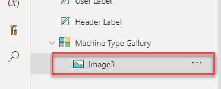](media/image-gallery.png#lightbox)
    
10.  Set the **Image** value to the following formula, which will set the image value to the photo URL:
    
    ```
    ThisItem.Photo
    
    ``` 
    
11.  Select the **Machine Type Gallery** and then select the edit button to put the gallery in edit mode.
    
[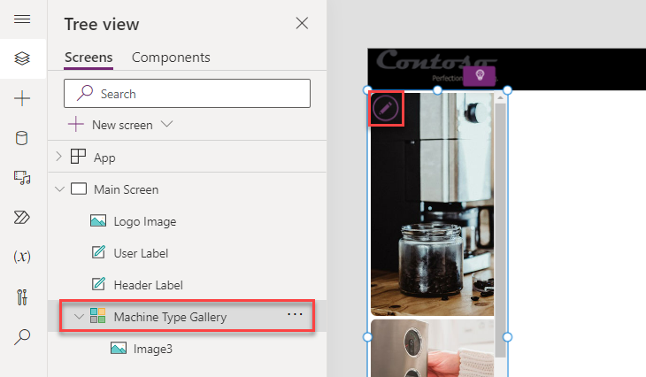]
    
12.  Reduce the height of the template cell so that all four images occupy the gallery without you having to scroll to view them. You want the image to occupy the entire cell.
    
[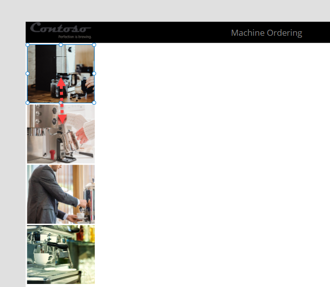](media/cell-height.png#lightbox)
    
13.  Make sure that the gallery is still in edit mode. Select **Insert** and then select **Text label**.
    
[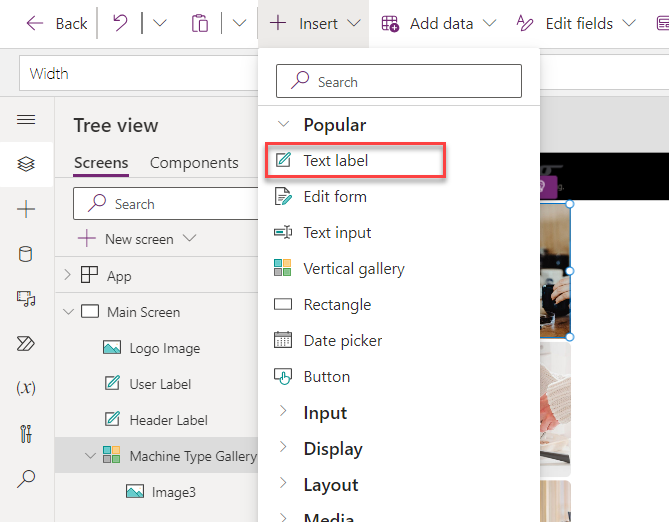](media/insert-label.png#lightbox)
    
14.  Set the **Text** value of the label to the following formula:
    
    ```
    ThisItem.Name
    ```
    
[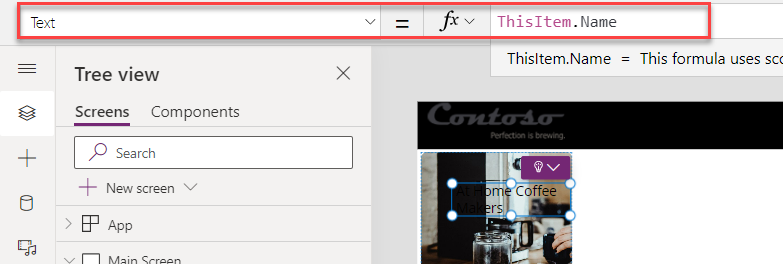](media/label-text-value.png#lightbox)
    
15.  Set the **X** value of the label to `0`.
    
16.  Set the **Y** value of the label to `132`.
    
17.  Set the **Width** value of the label to `192`.
    
18.  Change **Fill** color to `Color.Black`.
    
19.  Change **Color** to `Color.Gray`.
    
20.  Using the tool bar at the top of the page, change the **Size** to `10`.
    
[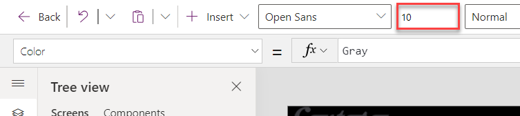](media/label-font-size.png#lightbox)
    
    The main screen should now resemble the following image.
    
[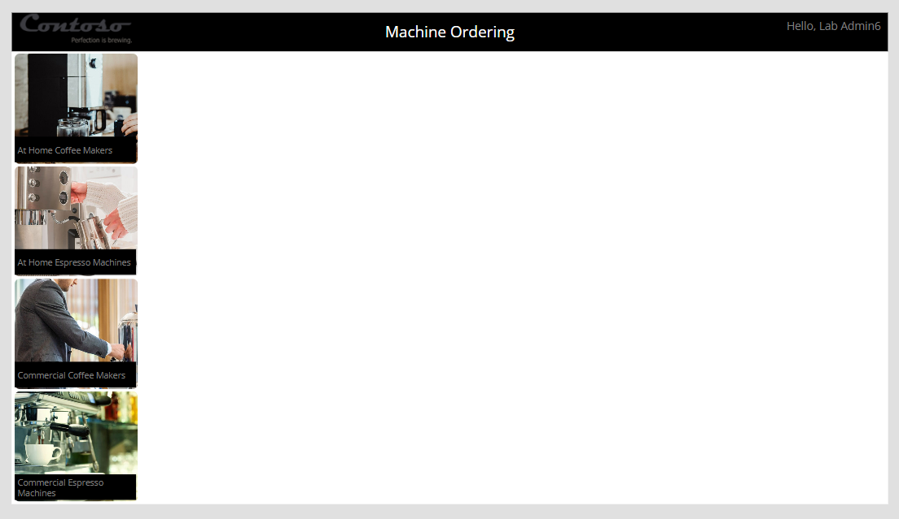](media/main-screen.png#lightbox)
    
21.  Select **Save** and then wait for the application to be saved.
    

Task: Add a machine gallery
---------------------------

Follow these steps to add a machine gallery:

1.  Select **Main Screen**, then select the **\+ Insert** drop-down, expand the **Layout** group, and then choose **Horizontal gallery**.
    
[](media/insert-horizontal-gallery.png#lightbox)
    
2.  Select **Machines** as the data source.
    
[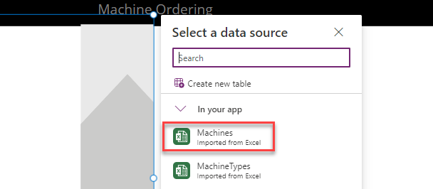](media/data-source.png#lightbox)
    
3.  Rename the gallery to `Machine Gallery`.
    
[](media/renamed-device-gallery.png#lightbox)
    

Task: Arrange the machine gallery
---------------------------------

To arrange the machine gallery, follow these steps:

1.  Expand the **Machine Gallery** and select the **Image**.
    
[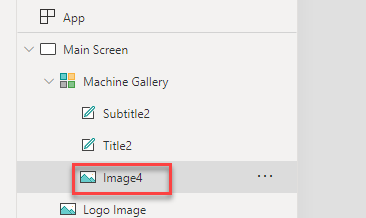](media/image-gallery-control.png#lightbox)
    
2.  Set the **Image** value of the image to the following formula:
    
    `ThisItem.Photo`
    
3.  Expand the **Machine Gallery** and select the **Title**.
    
4.  Set the **Text** value of the title to the following formula:
    
    `ThisItem.'Machine Name'`
    
5.  Expand the **Machine Gallery** and select the **Subtitle**.
    
6.  Set the **Text** value of the subtitle to the following formula:
    
    `ThisItem.Price`
    
7.  Select the **Machine Gallery** from the Tree View pane.
    
8.  Set the **X** value of the Machine Gallery to `200`.
    
9.  Set the **Y** value of the Machine Gallery to `60`.
    
10.  Set the **Height** value to `650`.
    
11.  Set the **Width** value of the Machine Gallery to `1160`.
    
12.  Select the **Machine Gallery**, go to the **Properties** pane, and set the **Wrap count** to `2`.
    
[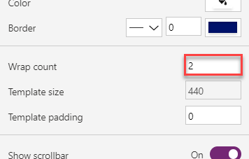](media/gallery-wrap-count.png#lightbox)
    
13.  Set the **Show scrollbar** toggle to **Off** and the **Show navigation** toggle to **On**.
    
[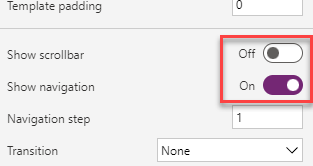](media/gallery-properties.png#lightbox)
    
14.  Select the image inside the **Machine Gallery**.
    
[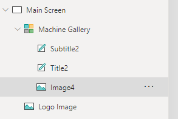](media/gallery-image.png#lightbox)
    
15.  Set the **Width** value of the image to `200`.
    
16.  Set the **Height** value of the image to `170`.
    
17.  Select the **Title** and **Subtitle** inside the gallery. Press the **Ctrl** key to select multiple controls.
    
[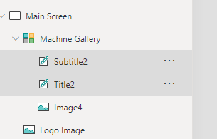](media/controls.png#lightbox)
    
18.  Go to the properties and select **Center** for **Text alignment**.
    
[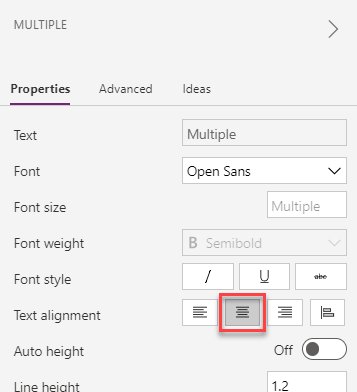](media/text-alignment.png#lightbox)
    
19.  Select **Machine Gallery** and then select the **Edit gallery** button.
    
[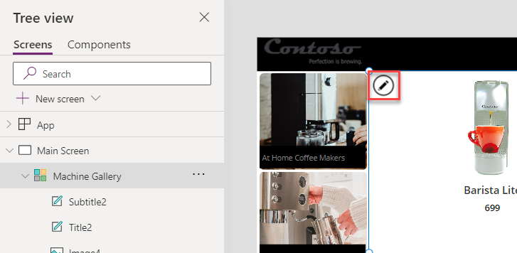](media/gallery-edit.png#lightbox)
    
20.  Make the template narrower until a total of **8** machines is visible.
    
[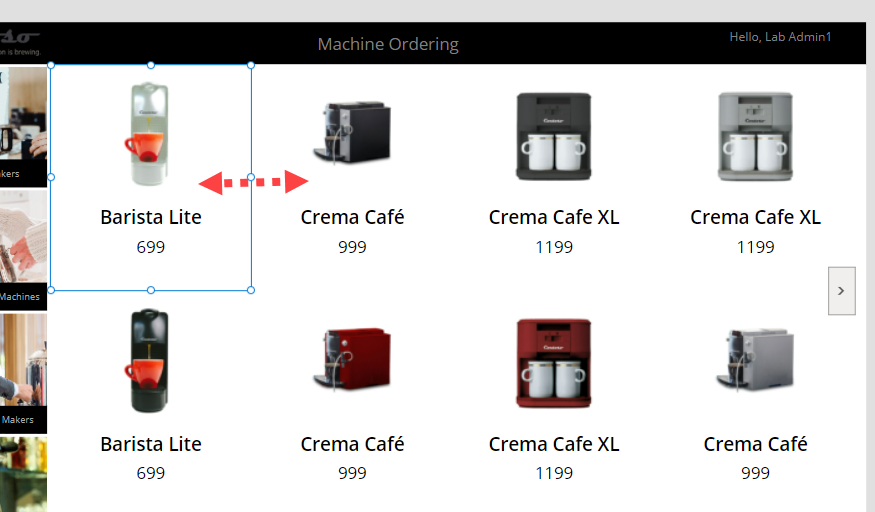](media/template-size.png#lightbox)
    

Task: Highlight the selected item in the gallery
------------------------------------------------

In this task, you use the **TemplateFill** property of the Machine Type Gallery to specify a highlight color for the selected item. You can decide how you want to indicate the selected item. You'll also change the label fill for this gallery.

1.  Expand the **Machine Type Gallery** and select the **Label** control.
    
[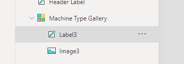](media/gallery-label.png#lightbox)
    
2.  Change the **Fill** value of the label to the following formula. This Power Fx formula sets the label fill to dark red for the selected item.
    
    `If(ThisItem.IsSelected,Color.DarkRed)`
    
    Alternatively, you could set the **Fill** property to: `If(ThisItem.IsSelected,ColorFade ('Header Label'.Fill,75%))`
    
    We recommend that you use this approach so that the fill color matches the header label with a 75 percent fade. If you change the fill color of header label, the fill color of the selected item in the gallery will automatically change.
    
[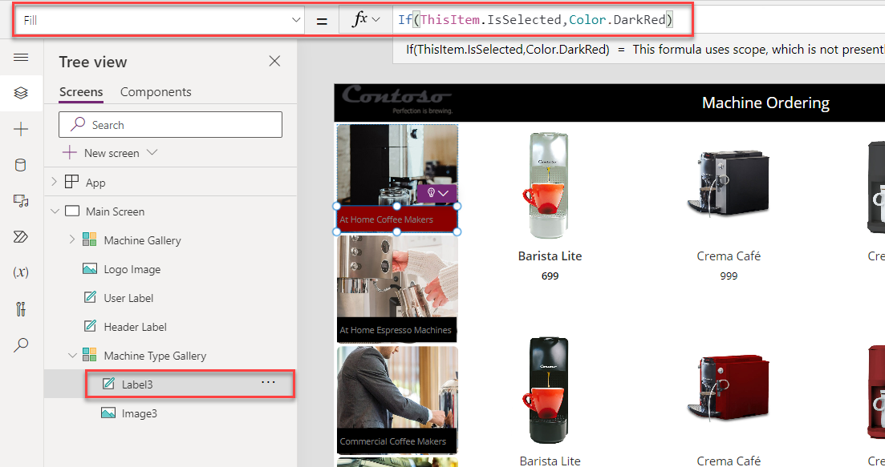](media/label-fill-value.png#lightbox)
    
3.  Try using the preview mode to perform a quick test of this highlighting. You can enable preview mode by holding down the **Alt** key (also known as the **Option** key) and selecting a few different manufacturers in the gallery. Notice that the selected item in the manufacturer gallery is highlighted. The preview mode ends when you stop holding the key.
    

Alternatively, you could select the **Play** button to enter preview mode. To exit preview mode, select the **X** in the upper-right corner or press the **Esc** key.

Task: Filter the machine gallery based on the selected machine type
-------------------------------------------------------------------

In this task, you use the **Filter()** function to filter items in the **Machine Gallery** to only display machines that match the selected item in the **Machine Type Gallery**.

1.  Select the **Machine Gallery**.
    
2.  Set the **Items** value to the following formula:
    
    `Filter(Machines, 'Machine Type ID' = 'Machine Type Gallery'.Selected.'Type ID')`
    
[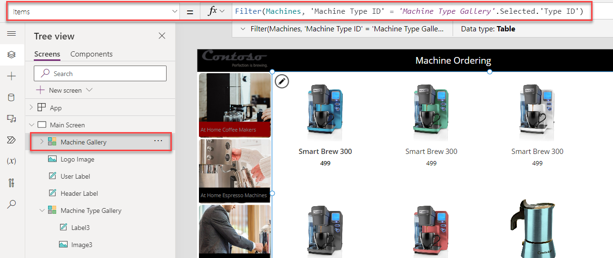](media/machine-gallery-items-value.png#lightbox)
    
    The Machine Gallery should now show machines that match the selected item of the machine types.
    
[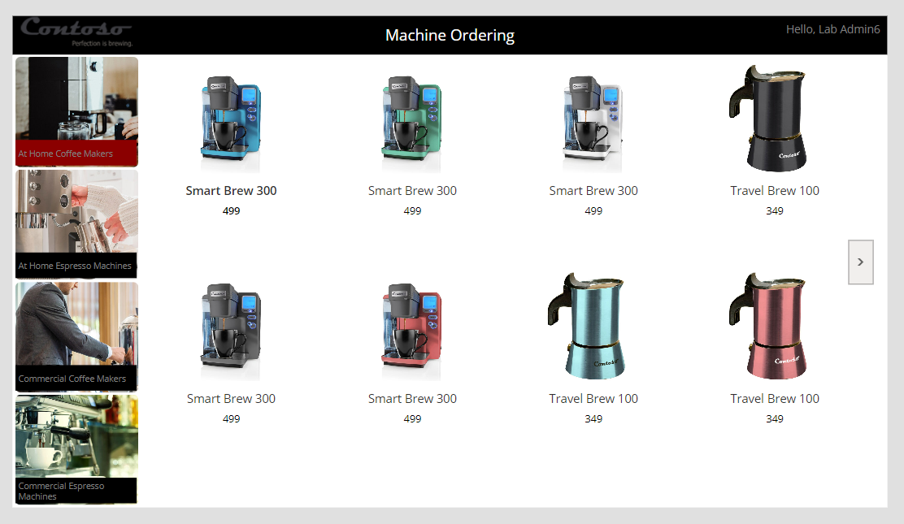](media/gallery-coffee-machines.png#lightbox)
    
1.  Select the **Preview the app** button.
    
[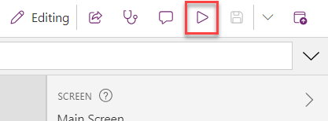](media/preview.png#lightbox)
    
    The app should load.
    
4.  Select an item from the navigation menu to the left of the Machine Type Gallery. The machine gallery should show machines that match the selected machine type.
    
5.  Close the preview.
    
[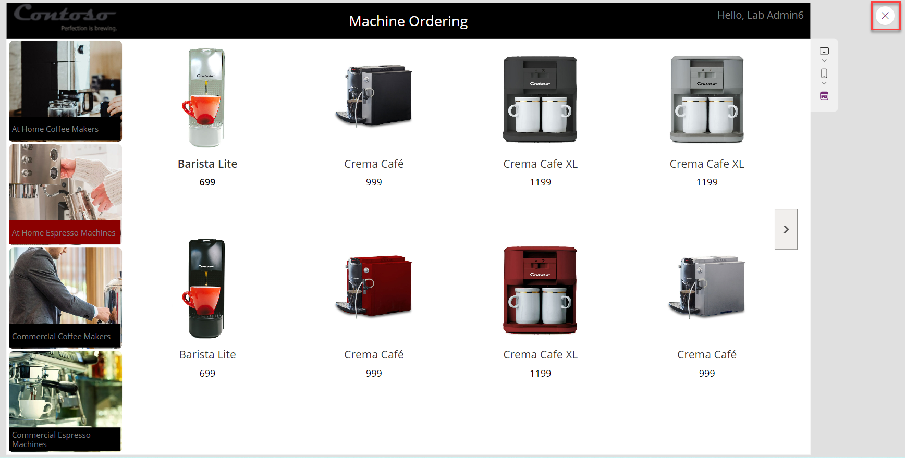](media/close-preview.png#lightbox)
    
    Note
    
    If you get an error when entering the **Filter()** command, check the name of the machine type gallery. The name in the filter command must match the name of your gallery.
    

Task: Set up text labels in the machine gallery
-----------------------------------------------

To set up text labels in the machine gallery, follow these steps:

1.  Expand the **Machine Gallery** and select the **Subtitle**.
    
2.  To add the dollar sign (**$**) to the Subtitle, change the Text value of the expression to the following formula:
    
    `Text(ThisItem.Price,"$##,###.00")`
    
    Note
    
    After you've entered the preceding value in the formula bar, it will automatically resolve to include your locale, such as \[$-en-US\]. If an error occurs, your locale might not be supported yet, in which case, as a workaround, you can manually change it to \[$-en-US\].
    
[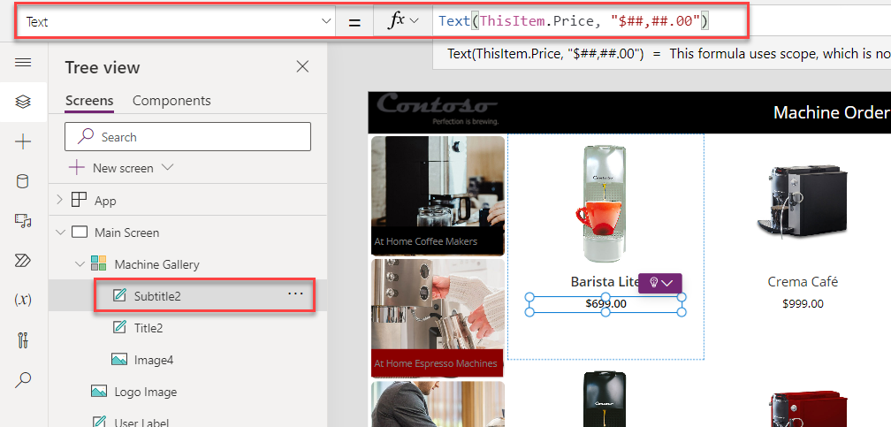](media/price-setting.png#lightbox)
    

Task: Conditional formatting to highlight machines above $10,000
----------------------------------------------------------------

You can make spotting machines that cost more than $10,000 easier by displaying the price in red font.

1.  Under the Machine Gallery, select the subtitle that displays the price and then set the **Color** value to the following:  
    `If(ThisItem.Price>10000,Color.OrangeRed,Color.Gray)`
    
[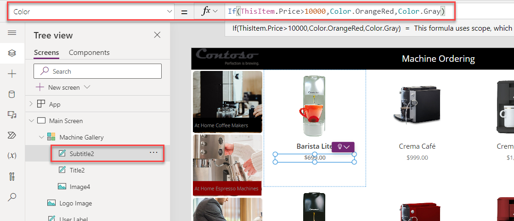](media/price-font-color.png#lightbox)

    Note
    
    As you're entering this formula, notice that autosuggest shows a choice of matching colors. Power Apps comes with a set of standard colors that you can reference in any property that accepts a color value. You can also set specific RGB color values.
    
1.  Select **Preview the app**.
    
2.  Select **Commercial Espresso Machines** from the Machine Type Gallery. The price for machines that are over $10,000 should become red.
    
[](media/espresso-machines.png#lightbox)
    
4.  Close the preview.
    
5.  Select **Save** and then wait for the application to be saved.
    

Task: Add a checkbox to add a machine to the Compare list
---------------------------------------------------------

Now, you'll want to allow users to select multiple machines to compare before making a final selection on the next screen.

1.  Select the **Machine Gallery** and then select the **Edit icon** in the upper left of the gallery to select the template cell.
    
[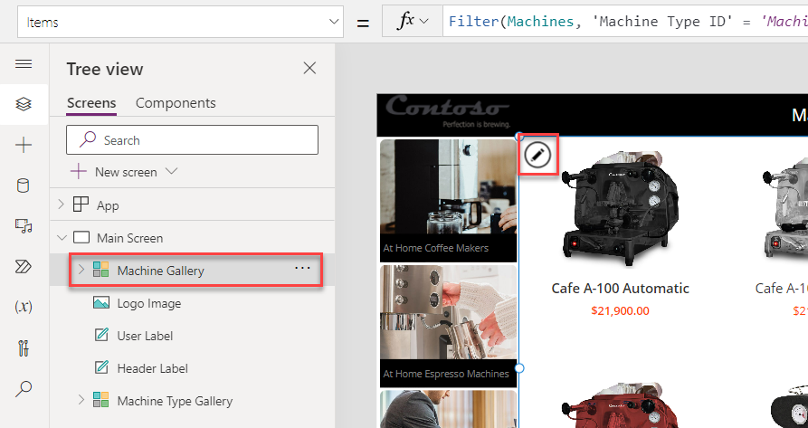](media/pencil-edit.png#lightbox)
    
2.  Make sure that only the first item in the gallery is selected (not the entire gallery).
    
[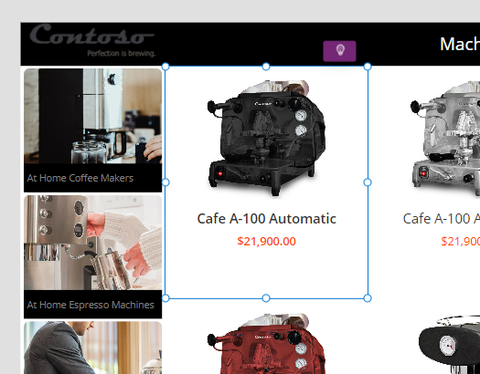](media/item-selected.png#lightbox)
    
3.  Select the **\+ Insert** drop-down, expand the **Input** group, and then select **Check box**.
    
[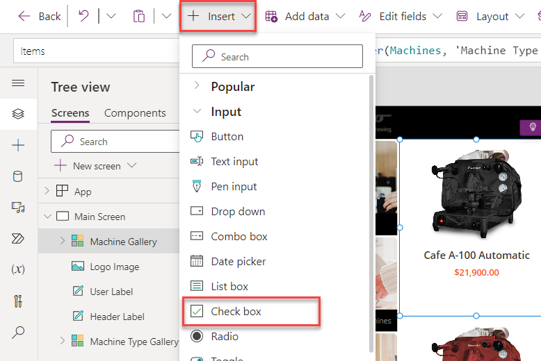](media/checkbox.png#lightbox)
    
4.  Move the inserted checkbox below the price.
    
[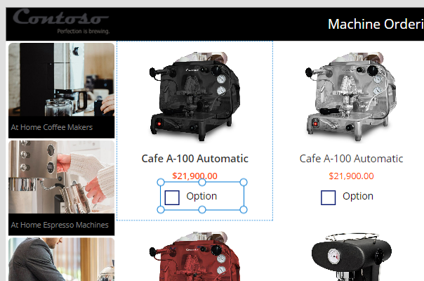](media/checkbox-placement.png#lightbox)
    
5.  Change the checkbox text to `Compare` by changing the **Text** property value within the formula bar.
    
[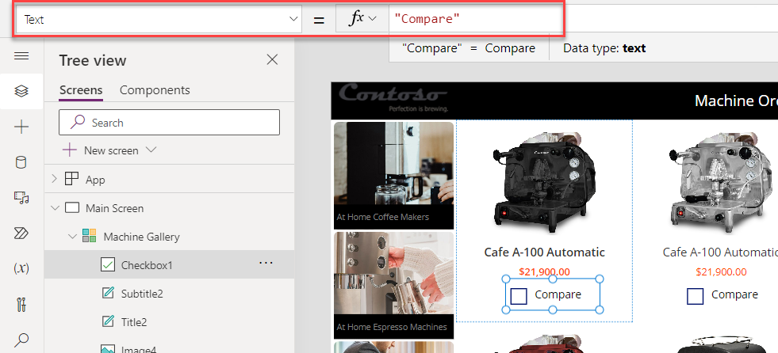](media/checkbox-text.png#lightbox)
    

Task: Create a collection for the selected machines
---------------------------------------------------

When a user selects a machine to compare, you add it to a collection called **CompareList**. Consider this collection as an in-memory collection of machines that have been selected for comparison.

1.  Select the **Checkbox** from within the Tree view pane and change the **OnCheck** value to the following formula:
    
    `Collect(CompareList,ThisItem)`
    
[](media/oncheck-value.png#lightbox)
    
2.  Set the **OnUncheck** value to the following formula:
    
    `Remove(CompareList,ThisItem)`
    
    This is step is required to make sure that the items that become unchecked are removed from the collection.
    
[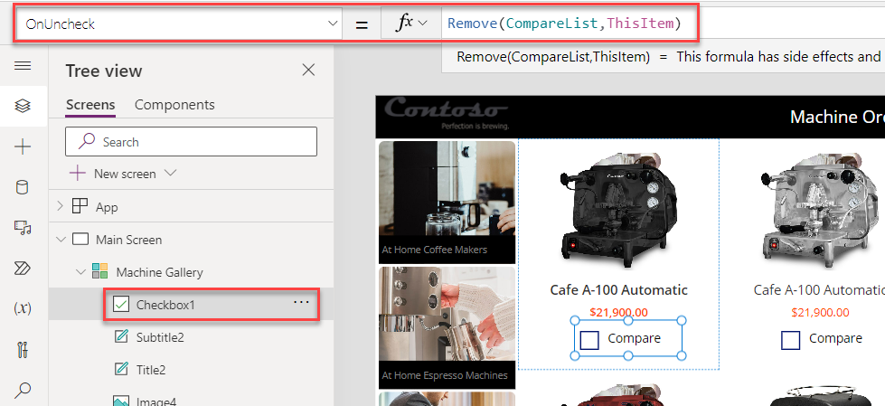](media/onuncheck-value.png#lightbox)
    
3.  Set the **Default** property of the checkbox to the following formula:
    
    `ThisItem in CompareList`
    
[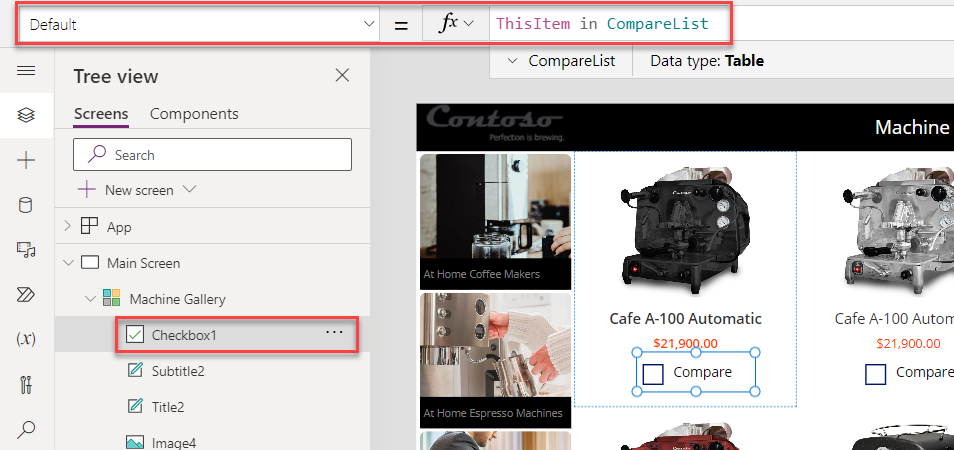](media/checkbox-default.png#lightbox)
    
    The **Default** setting of the checkbox is a Boolean true or false value that determines whether the checkbox should be checked by default or not. Setting this formula ensures that the checkbox is selected by default if the item has already been added to the collection because the result will be true, for example, this item **is** in CompareList.
    
4.  To test the adding of items to a collection, you can run the app in Preview (F5) or you can select the **Preview** button in the upper right. Select the checkboxes of three machines.
    
[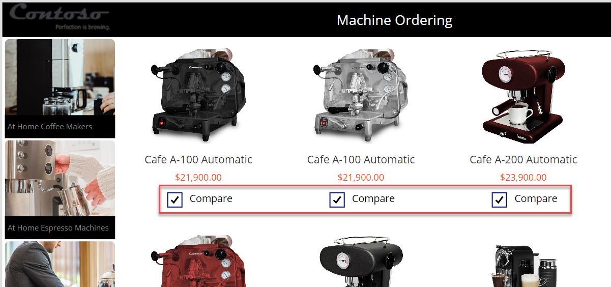](media/compare-checkboxes.png#lightbox)
    
5.  Close the preview.
    
6.  From the navigation pane to the left of the screen, select the **Variables** icon (X). Expand the **Collections** section.
    
7.  Hover over the **CompareList** and select the **ellipsis** to the right. Choose **View Table**.
    
[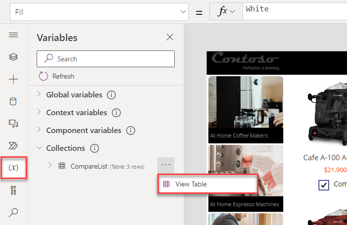](media/collections-button.png#lightbox)
    
    The **CompareList** collection and the three items that you selected will display.
    
[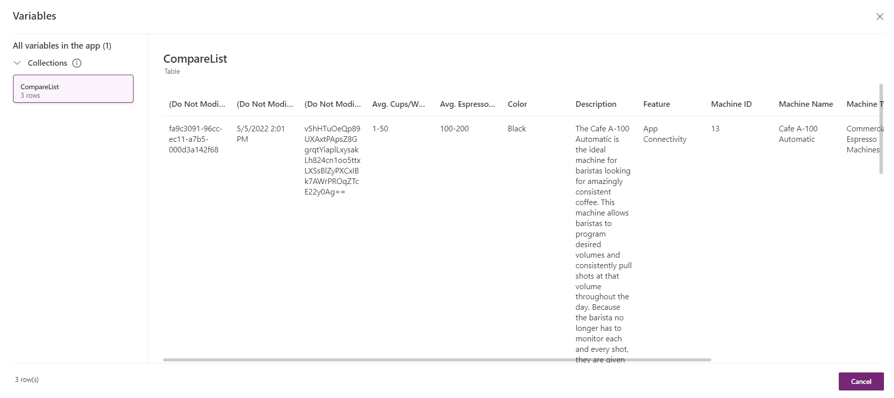](media/compare.png#lightbox)
    
    Each item in the collection has the information for each machine that you've received from the **Machines** data source, not just the fields that you display in the Machine Gallery.
    
8.  Select the **X** in the upper right corner to close out and return to the main view.
    
9.  Select the **Preview** icon again.
    
10.  Clear all items with check marks and then close the preview.
    
[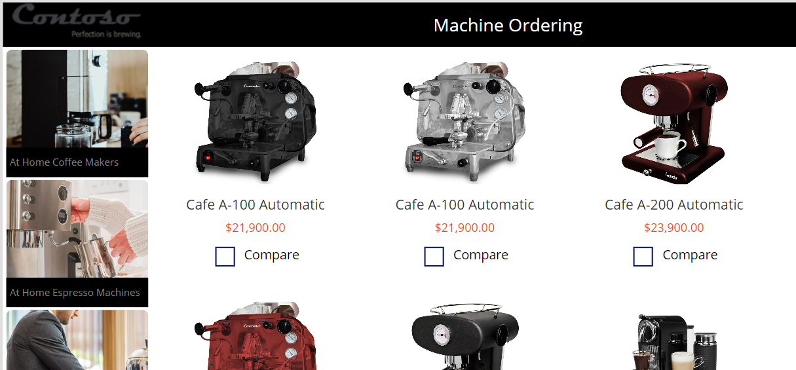](media/preview-checkboxes.png#lightbox)
    
11.  Select the ellipsis (**...**) button next to **CompareList** under the **Collections** section and then select **View Table** again.
    
    Notice that all items are removed from the **CompareList** collection.
    
12.  Select the **X** to close out of the dialog.
    

Task: Set the default selection to the first machine type and test the app
--------------------------------------------------------------------------

To avoid getting a blank list of machines when the app starts, set the default selected item in the Machine Type Gallery to be the first item.

1.  Select the entire gallery (by selecting **Machine Type Gallery** in the tree view on the left) and then set the **Default** property of the gallery in the formula bar to:
    
    `First(MachineTypes)`
    
[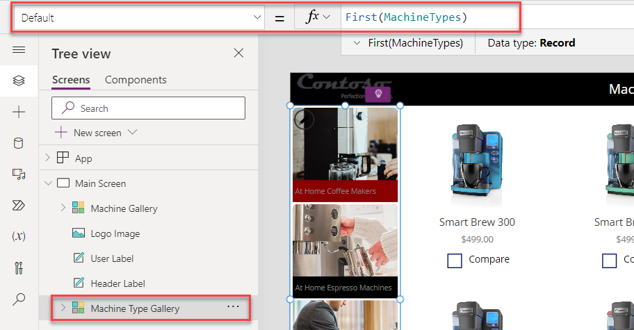](media/default-machine-type-gallery.png#lightbox)
    
    This action sets the selected item to be the first item in the table.
    
2.  To preview the app, select the **Preview** button on the upper right of the menu. Alternatively, you can press the F5 key to preview the application. You can also test your app directly on the canvas by holding down the Alt key to activate buttons and other controls.
    
3.  Your app should resemble the following image.
    
[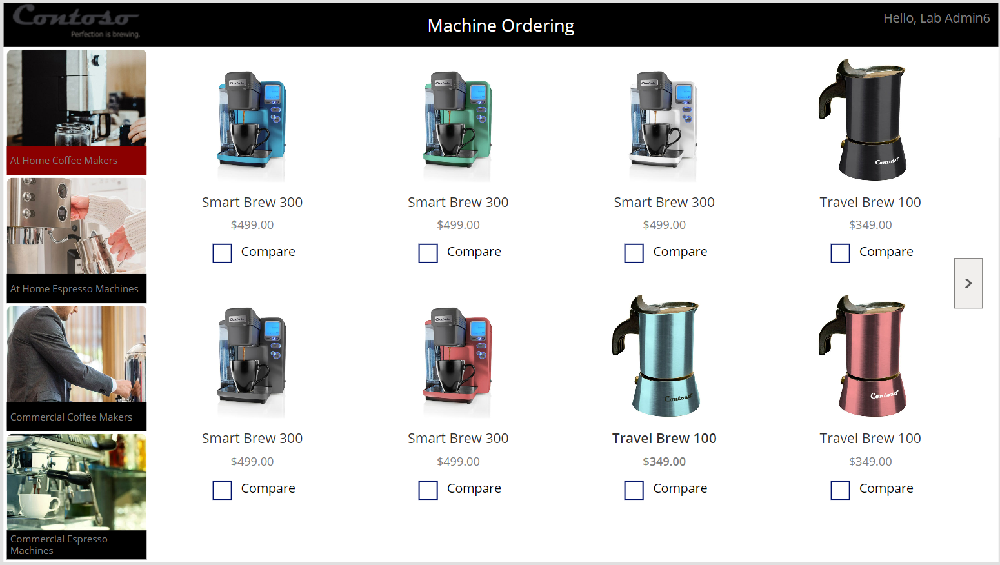](media/app-preview.png#lightbox)
    
4.  To exit preview mode, select the **X** in the upper-right corner.
    
5.  Select **Save** and then wait for the application to be saved.
    
6.  Don't navigate away from this page.
