Exercise 3 - Add the compare screen
=================================


The second screen is where users compare the selected machines and then choose the one that they want to submit for approval. This screen includes:

*   A back button for navigating back to the main screen.
    
*   A list of selected machines for comparison (carried over from the main screen).
    
*   Other details for each machine.
    
*   Highlighting of the selected machine.
    

In a subsequent lab, you create the database tables to store the machine orders, add an edit form to this screen to enter extra information, and then submit the request.

Note

To complete the exercises, you'll need to use a few files. Download the [Student files](https://github.com/MicrosoftDocs/mslearn-developer-tools-power-platform/raw/master/in-a-day/AIAD/AppinADayStudentFiles.zip) for use in this lab.

Task: Add a screen
------------------

Your first task is to add a new screen by following these steps:

1.  From the Tree View pane, select **\+ New screen** and then choose **Blank**.
    
    [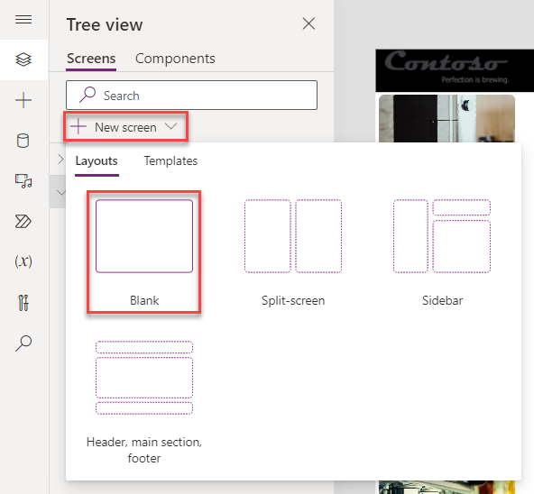](media/blank-new-screen.png#lightbox)
    
2.  Rename the screen to `Compare Screen`.
    
    [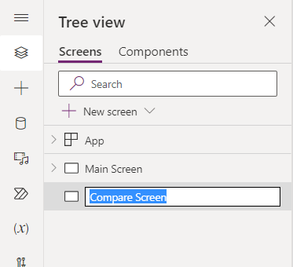](media/compare-screen.png#lightbox)
    
3.  From the Tree view pane, select the **Main Screen**, then select the **\+ Insert** drop-down. Expand the **Popular** group, and then choose **Button**.
    
    [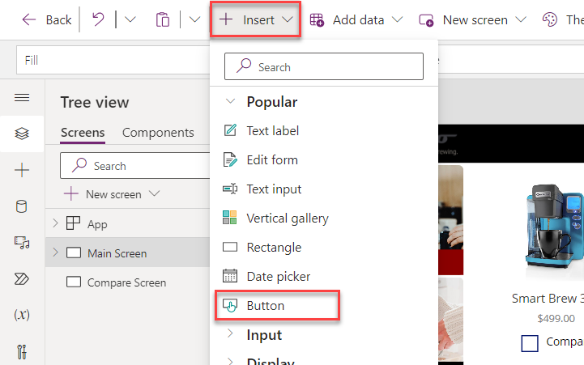](media/button.png#lightbox)
    
4.  Rename the button to `Compare Button`.
    
5.  Select the **Compare Button**.
    
6.  Set the button's **Text** property to the following:
    
    `"Compare " & CountRows(CompareList) & " item(s)"`
    
    [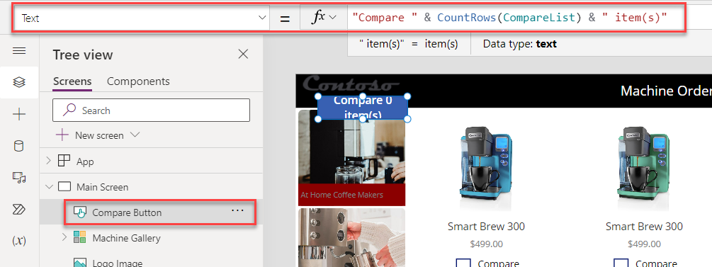](media/button-text-value.png#lightbox)
    
7.  Set the **Fill** value of the Compare Button to `Color.Black`.
    
8.  Set the **X** value of the Compare Button to `1130`.
    
9.  Set the **Y** value of the Compare Button to `720`.
    
10.  Set the **Width** value of the Compare Button to `220`.
    
11.  Set the **Height** value of the Compare Button to `40`.
    
12.  Set the **DisplayMode** of the Compare Button to the following formula. This Power Fx formula disables the button if no items are selected and will enable it if at least one item is selected.
    
    ```
    If(CountRows(CompareList) > 0, DisplayMode.Edit, DisplayMode.Disabled)
    ```
    
13.  Select the **Compare Button**, and within the **Properties** pane, set the **Border radius** to `0`.
    
[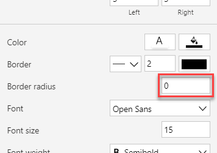](media/border-radius.png#lightbox)
    
14.  Select the **Compare Button** and then copy it by pressing the **Ctrl+C** keyboard shortcut.
    
15.  Paste the button on the same screen by using the **Ctrl+V** keyboard shortcut.
    
16.  Rename the button as `Clear Button`.
    
17.  Set the **X** value of the new **Clear Button** to `210`. Ensure that the **Y** value of the **Clear Button** to `720`.
    
[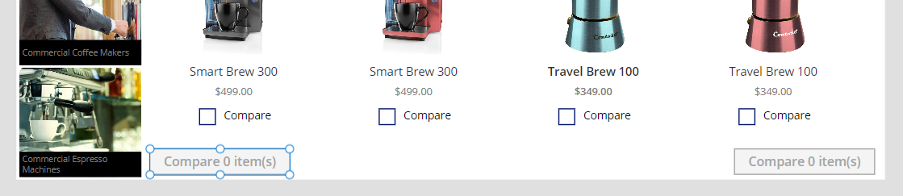](media/button-placements.png#lightbox)
    
18.  Change the **Text** value of the **Clear Button** to `"Clear Selection"`.
    
19.  Set the **OnSelect** value of the Clear Button to the following formula. This Power Fx formula removes all items in the CompareList collection.
    
    ```
    Clear(CompareList)
    ```
    
[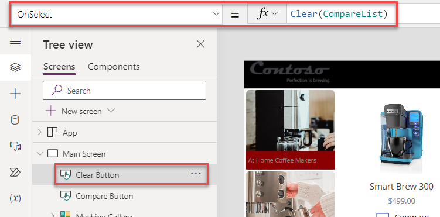](media/onselect-value.png#lightbox)
    
20.  Select the **Compare Button** and then change the **OnSelect** value to the following formula:
    
    ```
    Navigate('Compare Screen')
    ```
    
[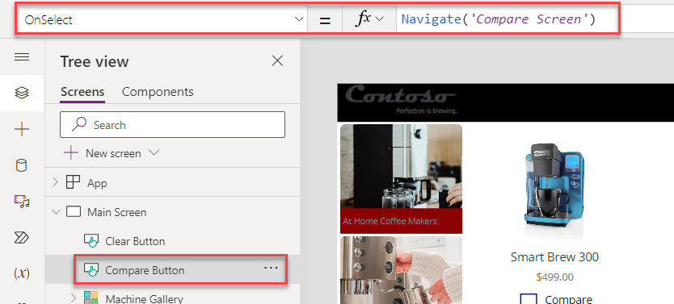](media/onselect-formula.png#lightbox)
    
21.  Select **Preview the app**.
    
22.  Select a couple of machines, select the **Compare** button, and then verify that it takes you to the second screen.
    
[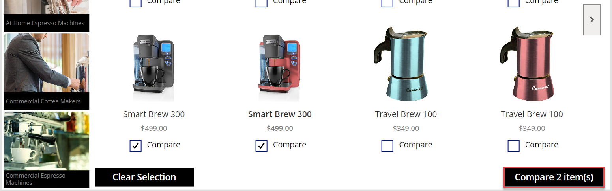](media/device-preview.png#lightbox)
    
23.  You should be directed to the new empty screen. Close the preview.
    
[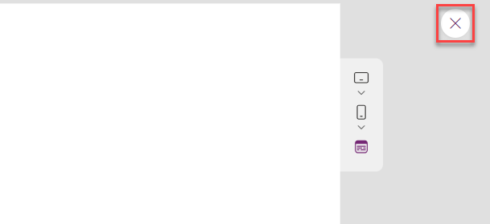](media/close.png#lightbox)
    
24.  Select the **Main Screen** in the tree view.
    
25.  Multi-select **User Label**, **Header Label**, and **Logo Image** from the **Machine Gallery** within the Tree View pane. Right-click and select **Group**.
    
[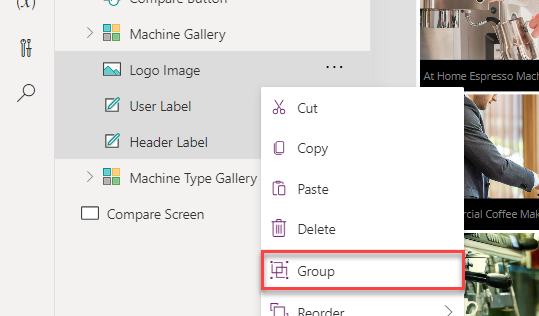](media/group.png#lightbox)
    
26.  Rename the group as `Header`.
    
27.  Select the ellipsis (**...**) button of the **Header** and then select **Copy**.
    
[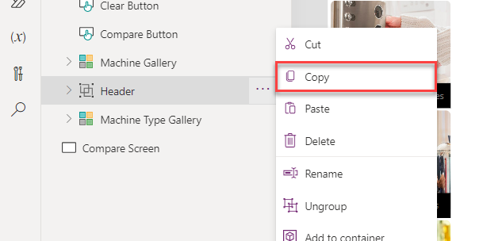](media/copy-control.png#lightbox)
    
28.  Right-click the **Compare Screen** option and then select **Paste**.
    
[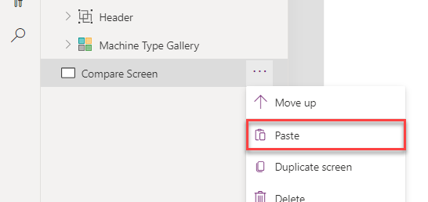](media/paste.png#lightbox)
    
    The **Header** in the **Compare Screen** should resemble the following image.
    
[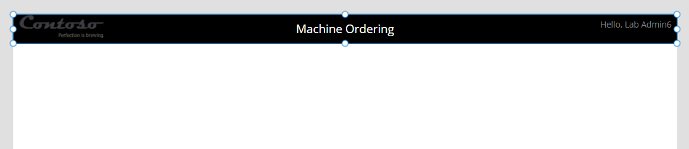](media/header-text.png#lightbox)
    
29.  Copy **Machine Gallery** from the **Main Screen** and then paste it in the **Compare Screen**.
    
30.  Rename the gallery in the Compare Screen as `Compare List Gallery`.
    
31.  Set the **X** value of the Compare List Gallery to `0`.
    
32.  Set the **Width** value of the Compare List Gallery to `840`.
    
33.  Set the **Height** value of the Compare List Gallery to `708`.
    
    The gallery should now resemble the following image. (if not, do a refresh and it should be good to go)
    
[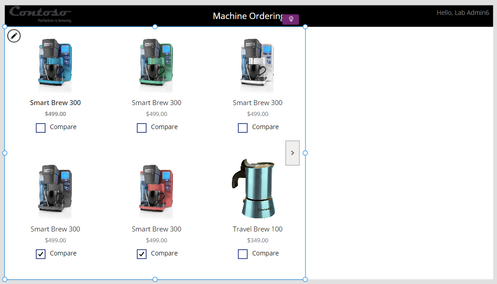](media/machine-list.png#lightbox)
    

Task: Set up the gallery
------------------------

In this task, you set up the gallery to show machines that were selected from the comparison gallery on the Main Screen.

1.  Select the new **Compare List Gallery** from the Tree view pane.
    
2.  Within the **Properties** pane, change the **Wrap count** to `1`.
    
[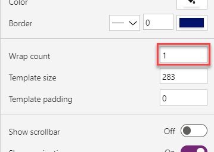](media/wrap-count-gallery.png#lightbox)
    
3.  Select **Items** from the property value dropdown list, then change the value within the formula bar to `CompareList`.
    

The gallery will now show the selected items from the Main Screen.

[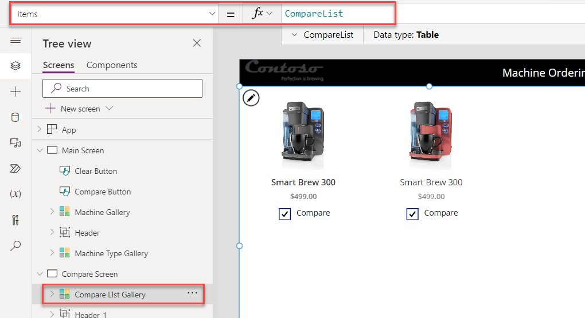](media/two-machine-preview.png#lightbox)

Task: Remove and add controls to the gallery
--------------------------------------------

In the **Compare Screen**, you're selecting a given item to get approved, so you don't need a **Compare** checkbox.

1.  From within the **Compare List Gallery** in the Tree view pane, select the **Compare** checkbox and then press the **Delete** key to delete the checkbox.
    
2.  Add a few labels to display other attributes about the machine. A method is to copy and paste. Select the first label in the gallery that's displaying the machine name. **Copy** the label (**Ctrl+C**) and then **paste** it (**Ctrl+V**). Rename these labels so that you can easily identify them later.
    
3.  Move the new label so that it's below the price. Set the **Text** property to:
    
    ```
    ThisItem.Feature
    ```
    
[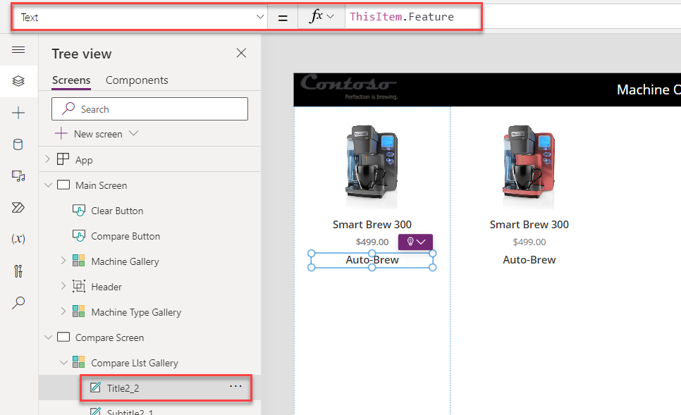](media/machine-feature-setting.png#lightbox)
    
4.  Use the ribbon tool bar at the top of the page to change the font weight from **Semibold** to **Normal**. Then change the **Size** property to `14`.
    
[](media/font-settings.png#lightbox)
    
5.  Copy and paste this label and then move the new fourth label below the third label. Set the **Text** property to:
    
    ```
    ThisItem.'Avg. Cups/Week'
    ```
    
[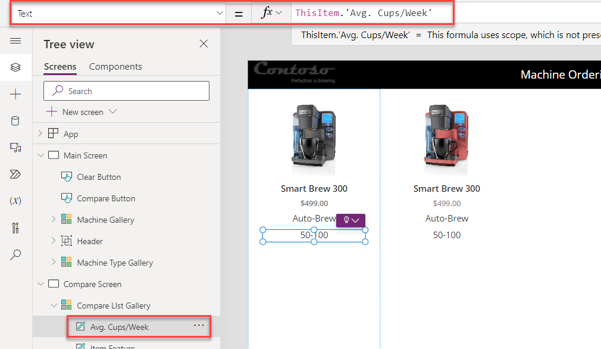](media/average-setting.png#lightbox)
    
6.  Repeat the previous steps to add text boxes to display the other machine properties, including the **Avg. Espressos/Week** value, and the **Description**. You can customize the labels by changing their Size, Color, Fill, and Font Weight properties.
    
7.  Select the **Description** label inside the gallery.
    
8.  Change the **Size** of the Description to `12`.
    
9.  Change the **AutoHeight** value, located within the Properties pane, of the Description to `true`.
    
10.  Multi-select all of the labels inside the gallery within the Tree view pane.
    
[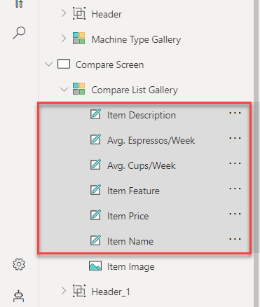](media/multiple-labels.png#lightbox)
    
    Note
    
    Within the image above, you will notice that each label has been renamed to correspond with the purpose of the label within the app.
    
11.  Go to the Properties pane and set the **Text alignment** to **Align left**.
    
[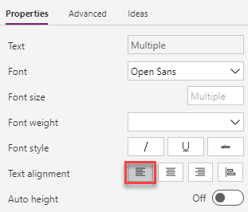](media/alignment-text.png#lightbox)
    

The gallery should now resemble the following image.

[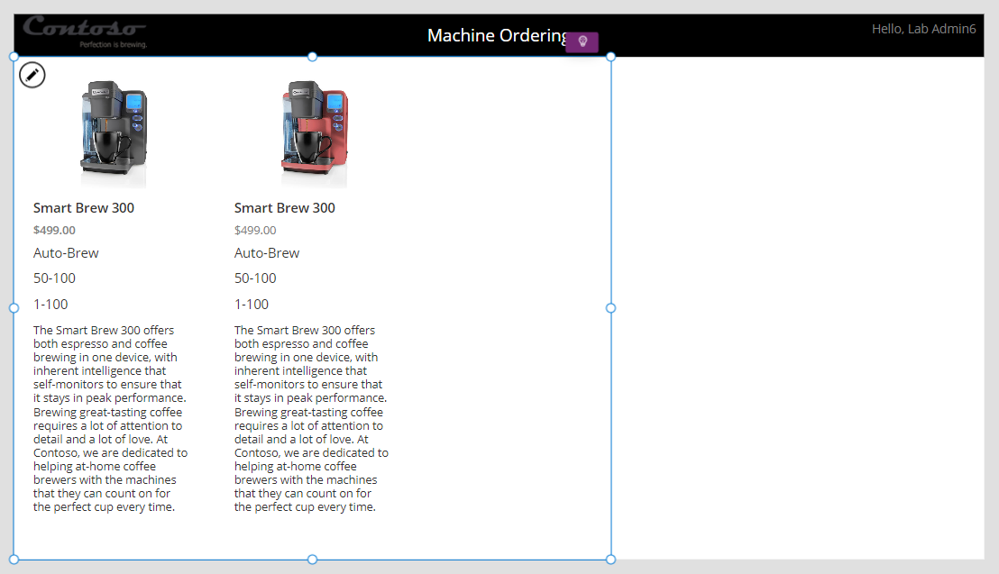](media/coffee-machines.png#lightbox)

Note

To save time in this lab, you can add one or two of these extra properties and then skip adding the other machine properties.

Task: Highlight the selected machine
------------------------------------

To highlight the selected machine, follow these steps:

1.  Select the **Compare List Gallery**.
    
2.  With the gallery selected, set the **TemplateFill** property to:
    
    ```
    If(ThisItem.IsSelected,ColorFade('Header Label'.Fill, 75%))
    ```
    
[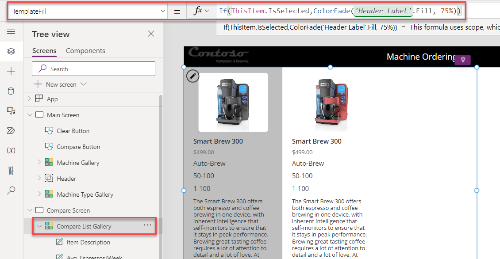](media/template-fill.png#lightbox)
    
    This step will conditionally set a Fill color if the cell is selected.
    
    You could have set a specific color or RGB value, but we recommend that you use the ColorFade function so that it matches the header label with a 75 percent fade. If you change the fill color of header label, this template fill color will automatically change.
    
3.  While pressing the **Alt** key, select a different item in the gallery. Notice that the selected item is highlighted in a light gray color.
    

Task: Add an icon to navigate to the first screen
-------------------------------------------------

In this task, you add an icon to navigate to the first screen.

1.  Select the **Compare Screen**.
    
2.  Select the **\+ Insert** drop down, search for `left`, and then choose the **Left** icon.
    
[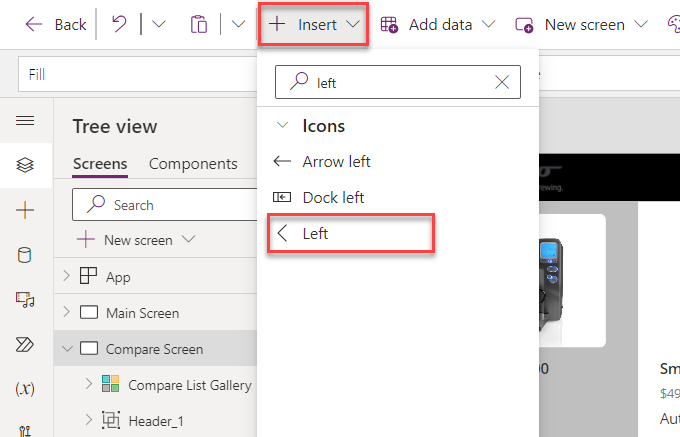](media/left.png#lightbox)
    
3.  Set the **Color** of the icon that you added to `Color.Gray`.
    
4.  Set the **X** of the icon to `220`.
    
5.  Set the **Y** of the icon to `5`.
    
6.  Set the **Height** of the icon to `50`.
    
7.  Set the **Width** of the icon to `50`.
    
8.  Set the **OnSelect** action for the icon to `Back()`, which will cause navigation back to the previous screen.
    
[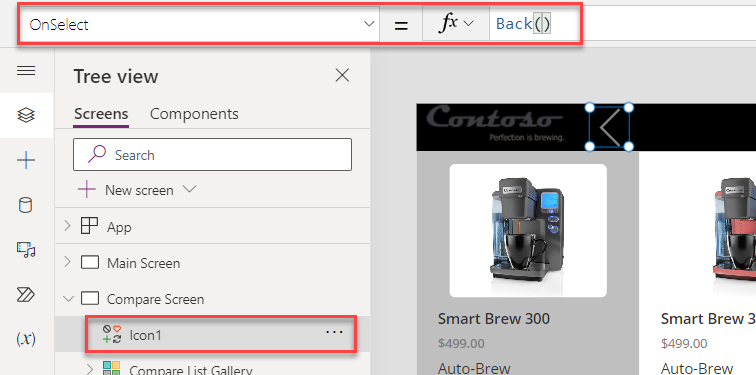](media/icon-value.png#lightbox)
    

### Optional UI enhancement

Add **padding around the icon** by using the Properties pane. Set the padding values to `10` for the **Top**, **Bottom**, **Left**, and **Right** settings. As a result, the icon looks smaller but will still have a larger hit target for the click action. This pattern is optimal for most icons.

Task: Test the app
------------------

Select **Save** to save your app. It's a good idea to save your app regularly. You can also test your app directly on the canvas by holding down the **Alt** key to activate buttons and other controls and then double-clicking to type into controls.

1.  Go to the **Main Screen** and **Preview** the app by selecting the **Play** button in the upper right.
    
2.  Clear any selected machines, if necessary.
    
3.  Select one of the machine types.
    
4.  Select the **Compare** checkbox on a few machines on the main screen.
    
5.  Select the **Compare** button to go to the compare screen.
    
6.  Tap or select a different machine in the gallery and then verify that the selection highlight works.
    
7.  Select the **Back** button and then confirm that you return to the main screen.
    
    [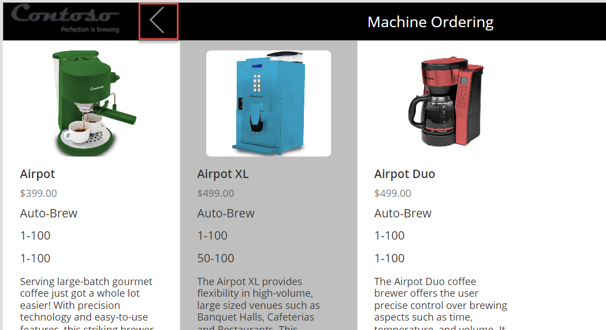](media/back.png#lightbox)
    
8.  Select **Clear Selection**.
    
    [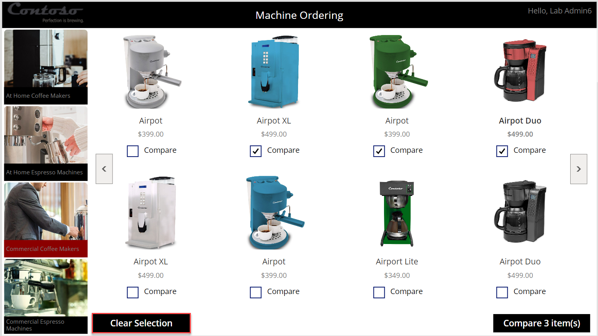](media/clear-selection.png#lightbox)
    
    The **CompareList** should clear, and the **Compare** button should become disabled.
    
    [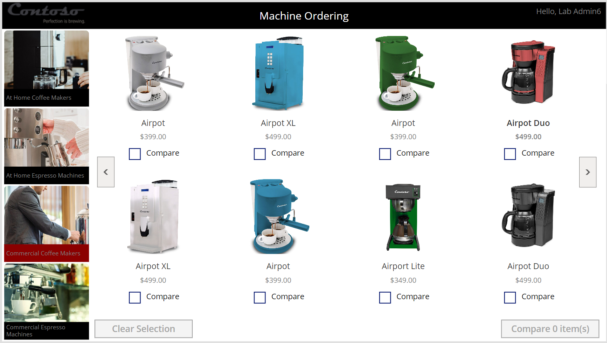](media/disabled-buttons.png#lightbox)
    
9.  Close the preview.
    

Congratulations, you've created your Power Apps application. Now, you can publish and test it on a mobile device.


Summary
=======

In this module, you began building the solution for Contoso Coffee. This canvas app will allow users to compare products and place requests for products. Continue with the remaining modules to build the data model and a back-office app and to automate the approvals.

