Exercise 1 - Explore Microsoft Dataverse
======================================

In this exercise, you'll explore Microsoft Dataverse standard tables. Tables in Microsoft Dataverse are similar to tables in a database or worksheets in Microsoft Excel. You can connect tables together with relationships that model real-world interactions between the data. Each table contains multiple rows (records), each having data columns. For example, a Project table might have columns such as Name, Due Date, and Status, and it might be related to a Project Owner table, which might have columns such as Name and Email.

Microsoft Dataverse abstracts much of the typical low-level database management work to help make it easier for you to set up a custom data model that fits your application.

Note

To complete the exercises, you'll need to use a few files. Download the [Student files](https://github.com/MicrosoftDocs/mslearn-developer-tools-power-platform/raw/master/in-a-day/AIAD/AppinADayStudentFiles.zip) for use in this lab.

Task - Explore standard tables
------------------------------

In this task, you'll explore Microsoft Dataverse standard tables.

Before beginning the exercises, go to [Make Microsoft Power Apps](http://make.powerapps.com/?azure-portal=true) and confirm that you're in your training environment for the labs.

1.  In the navigation pane to the left of the screen, select **Tables**.
    
    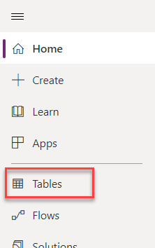
    
2.  A list of tables in this environment will display. Select a few of the standard tables (such as **Account**) to get familiar with some features of a table.
    
    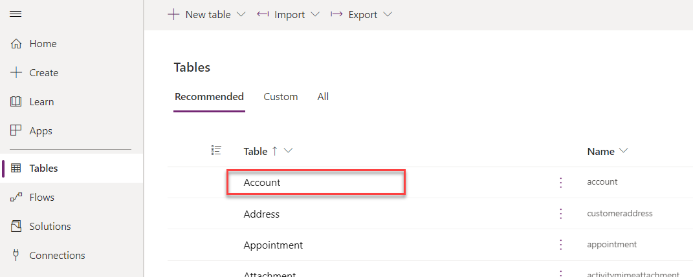
    

### Table properties

In the **Table properties** section, you'll find the table name, table type, the table's primary column, and table description. You can also copy the table's set name, schema name, or logical name from the **Tools** dropdown menu.

[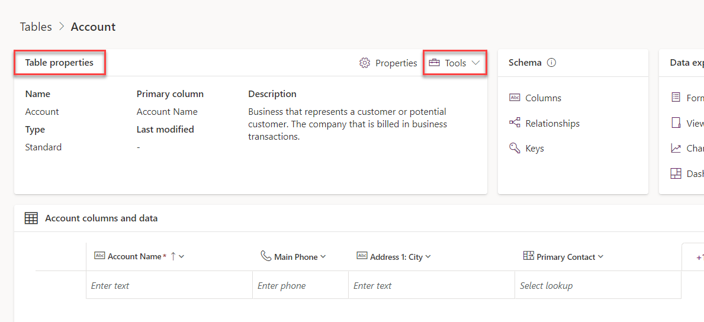](media/table-properties.png#lightbox)

### Table schema

In the **Schema** section, you can navigate to the table columns, relationships, and keys. For this exercise, select **Columns**.

[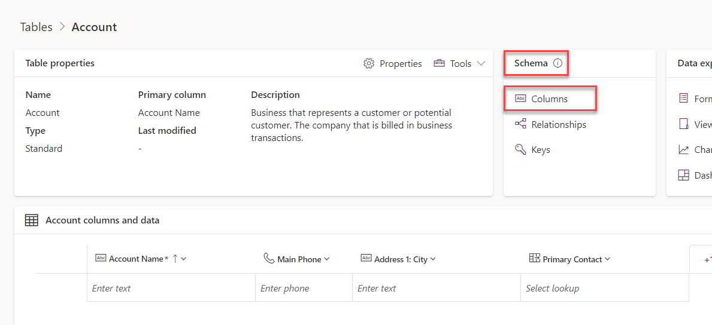](media/table-columns.png#lightbox)

### Columns

A table has a list of columns. In the following example, the Account table has columns such as **Account Name** and **Account Number**. Each column has a data type, such as **Text** and **Number**. The system chooses the data type when you create a column, and this value isn't changeable. The data type also defines many characteristics and behaviors of the column when your application runs. For example, a **Choice** column allows you to have a predefined list of values for use in your application. When this column is used on a form in a model-driven application, the visual presentation is a dropdown control. The column helps to ensure data consistency and allows for built-in support for multi-language applications.

[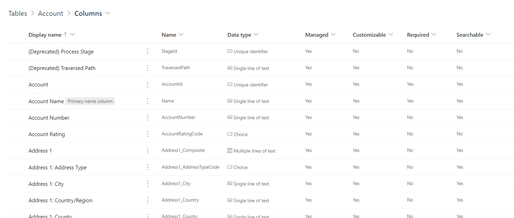](media/data-type-column.png#lightbox)

Return to the table by selecting the browser's back button.

Select **Relationships**.

[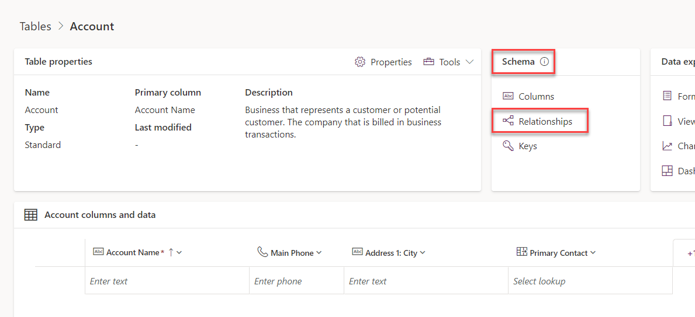](media/relationships.png#lightbox)

### Relationships

Relationships allow you to manage relationships between tables. Supported relationships include one to many (1:N), many to one (N:1), and many to many (N:N). Relationships also define the behavior that happens when actions occur on the primary row in a 1:N relationship. For example, if the parent row has been deleted, you can set up the relationship behavior so that all child rows are also deleted, or you can remove the reference.

[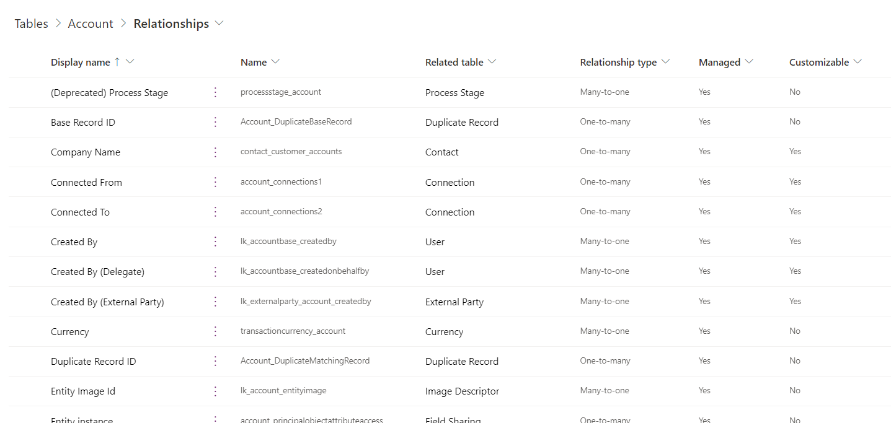](media/relationship-type.png#lightbox)

Return to the table by selecting the browser's back button.

Select **Keys**.

[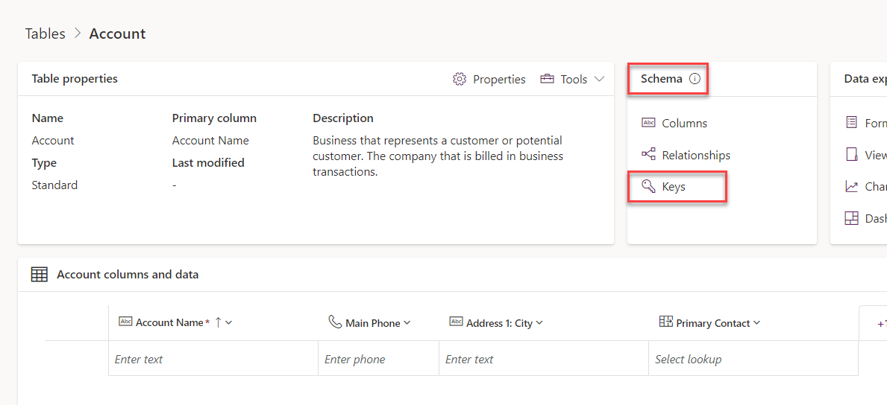](media/keys.png#lightbox)

### Keys

By selecting the **Keys** menu, you can view the lookup keys for the table. Keys can contain multiple columns to define a composite key. Keys enforce uniqueness, so you shouldn't use them when you need to store duplicate values of used columns.

Return to the table by selecting the browser's back button.

### Data experiences

With the **Data experiences** menu, you can navigate to the table forms, views, charts, and dashboards. Select **Forms**.

[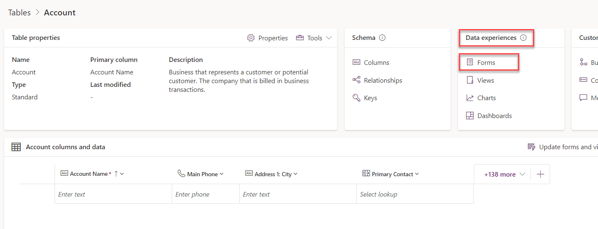](media/data-experience.png#lightbox)

### Forms

You can use forms to interact with the data that you need to do your work. Make sure that the forms that you use are designed to help you efficiently find or enter the information that you need. From the **New form** dropdown menu, you can create different types of forms, such as **Quick Create**, **Quick View**, **Card**, and a **Main** form. Some forms have more than one version to accommodate different user roles within your organization.

[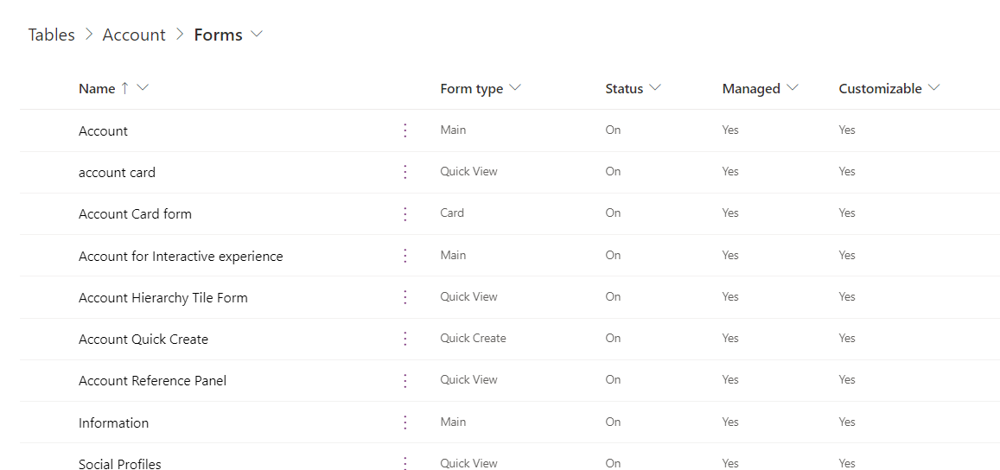](media/form-type.png#lightbox)

Return to the table by selecting the browser's back button.

Select **Views**.

[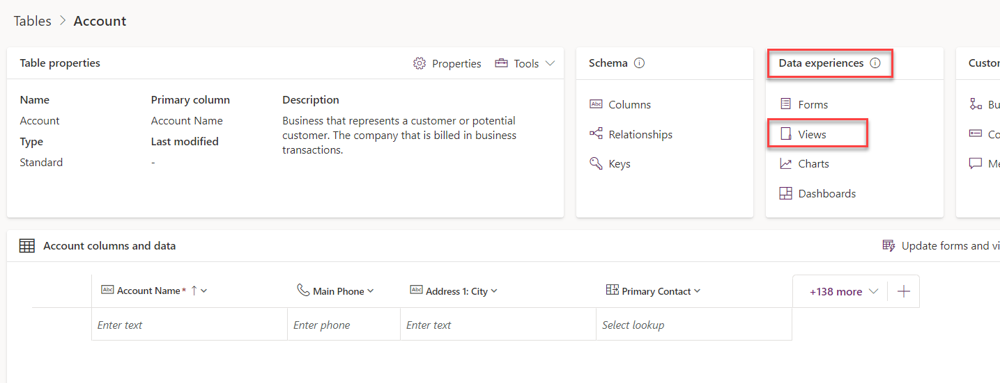](media/table-views.png#lightbox)

### Views

Views will let you define how a list of rows are shown in the app. You can create multiple custom views, each having its own filtering and sorting criteria. For example, you could create a view so that only the rows that were created in the last week are visible, and you could create another view for rows that haven't been updated in a year. Create views to make the application users more productive in filtering their data.

[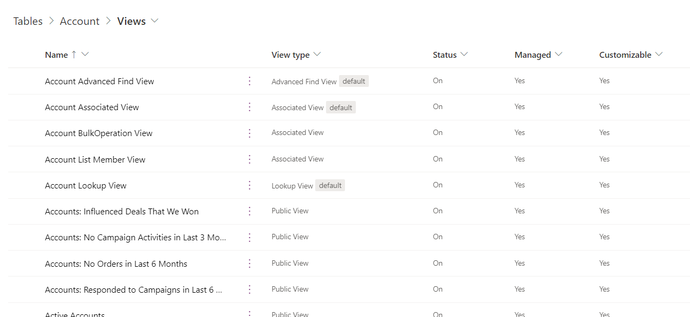](media/view-type.png#lightbox)

Return to the table by selecting the browser's back button.

Select **Charts**.

[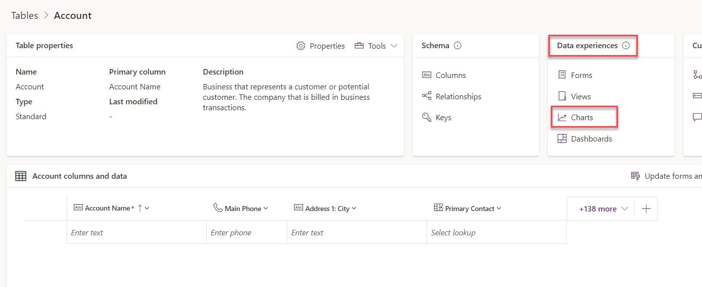](media/table-charts.png#lightbox)

### Charts

Use charts to display a high-level view of your data in insightful and graphical ways.

[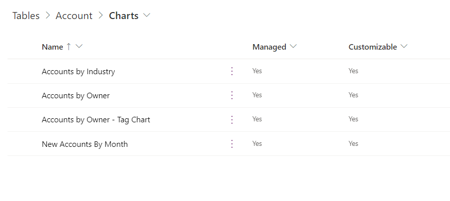](media/table-chart.png#lightbox)

Return to the table by selecting the browser's back button.

Select **Dashboards**.

[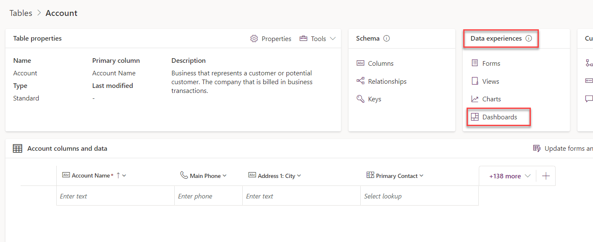](media/dashboards.png#lightbox)

### Dashboards

Dashboards help you bring your views, charts, and web resources together in one place.

[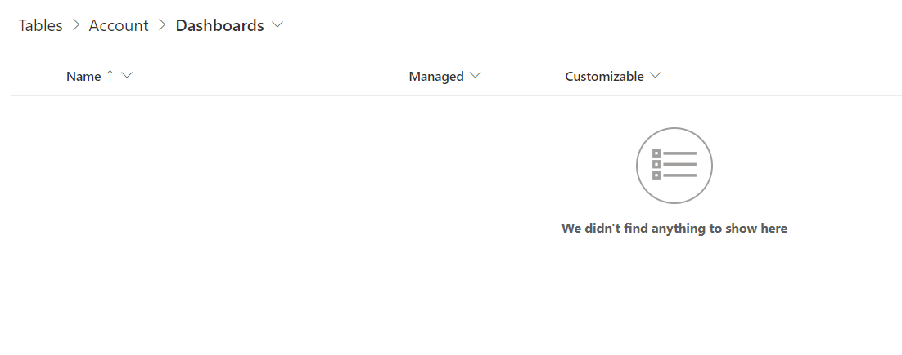](media/table-dashboards.png#lightbox)

Return to the table by selecting the browser's back button.

### Customizations

In the **Customizations** section, you can navigate to the table business rules and commands. Select **Business rules**.

[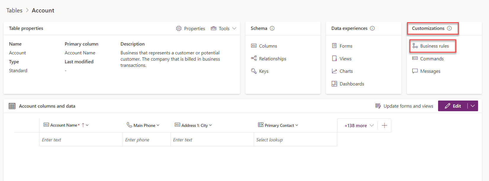](media/business-rules.png#lightbox)

### Business rules

Building a business rule is similar to building a flowchart where you can define conditions and actions.

[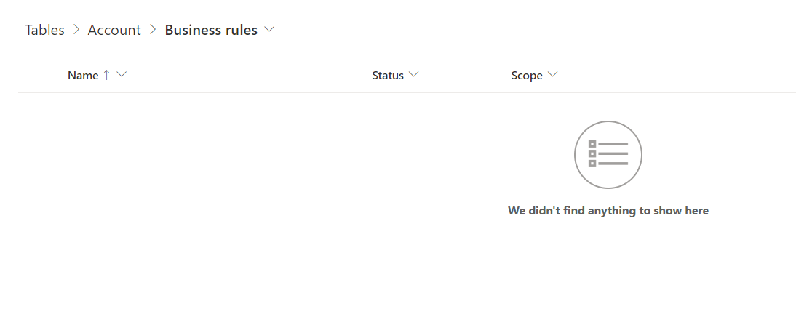](media/table-business.png#lightbox)

Return to the table by selecting the browser's back button.

Select **Commands**.

[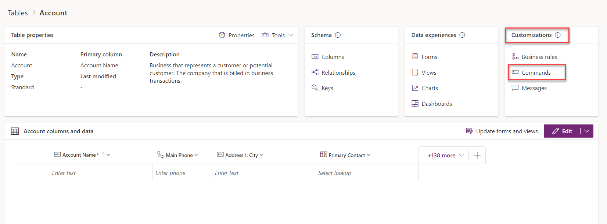](media/commands.png#lightbox)

### Commands

Microsoft Dataverse allows you to create your own command bar buttons. The commands that you add to the table will be listed in the **Commands** section.

[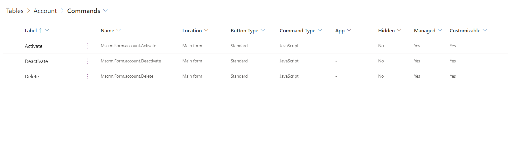](media/table-commands.png#lightbox)

Return to the table by selecting the browser's back button.

### Columns and data

The **columns and data** section shows the first 10 rows of the table data. You can also view more columns by selecting the **Show existing columns** button, add a new column by selecting the **\+ new column** button, edit table data with the **Edit** button, and order columns to your liking by dragging and dropping columns.

[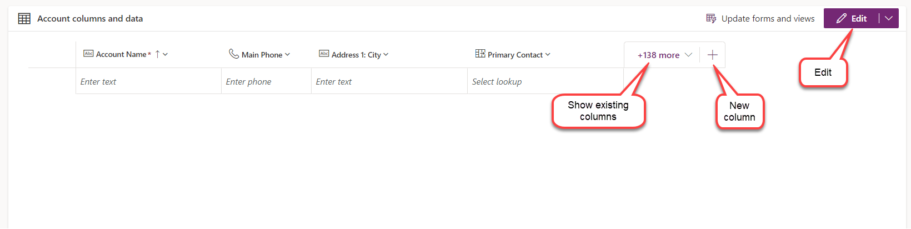](media/data-view.png#lightbox)

Select the **Edit** button.

### Edit

By selecting the **Edit** button, you can create a new row, create a new column, refresh the data to view the latest rows, create an app from the data, and edit the table properties.

[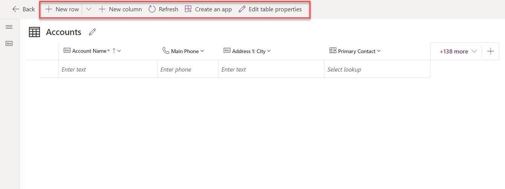](media/table-edit.png#lightbox)

You can delete one or more rows by selecting the rows that you want to delete.  For this exercise, **don't delete rows**.

[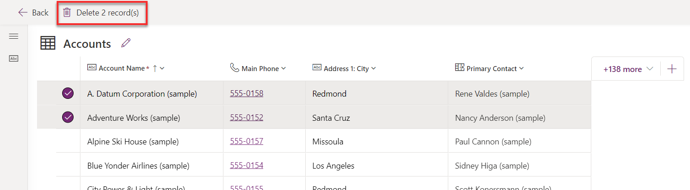](media/delete-rows.png#lightbox)

Select the **Back** button.

Task - Explore standard choices
-------------------------------

Similar to standard tables, Microsoft Dataverse includes a set of standard choices. You can also create custom choices. Later in this lab, you'll create a custom choice called **ApprovalStatus** to set the approval status of a machine order.

1.  Select **Choices** from the navigation pane to the left of the screen. If you do not see **Choices** within the navigation pane, you may need to select **More**.
    
    [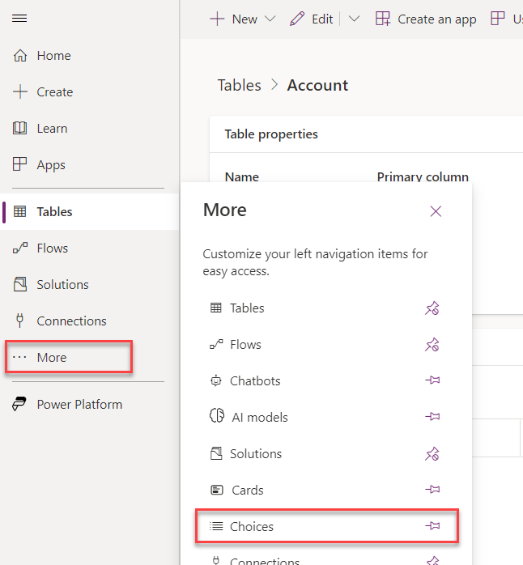](media/choices.png#lightbox)
    
2.  Examine the standard choices. Have a look at them to get to know them
    
    
