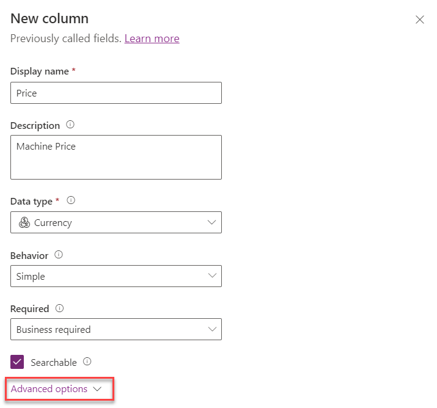

Exercise - Create custom tables and columns
===========================================

In this exercise, you create a new custom table named Machine Order, and you add columns that are necessary for tracking the machine requests. You'll also create a server-side business rule that defaults the estimated ship date.

Note

To complete the exercises, you'll need to use a few files. Download the [Student files](https://github.com/MicrosoftDocs/mslearn-developer-tools-power-platform/raw/master/in-a-day/AIAD/AppinADayStudentFiles.zip) for use in this lab.

Task - Create a custom table
----------------------------

In this task, you create a custom table to store machine order requests.

1.  Select **Solutions** and then open the **Contoso Coffee** solution.
    
2.  Select the **\+ New** drop down from the tool bar at the top of the page, hover over the **Table** option and then choose **Table**.
    
    
    
3.  Enter `Machine Order` in the **Display name** field. The **Plural name** field will automatically populate based on your entry in the **Display name** field. These fields are editable if you need to make changes. The system uses the plural name by default whenever a set of rows are shown.
    
    Select the **Enable attachments** option because it allows you to create notes on the machine order.
    
    
    
4.  Select the **Primary column** tab.
    
5.  Change the **Display name** field to `Machine Name`. The **Primary** column defaults to being named **Name**. For some scenarios, that label might not be the best one, so you can customize it if needed. However, the **Primary** column is always a text column that isn't changeable.
    
6.  Select **Save**.
    
    
    

Task - Create custom columns
----------------------------

In this task, you create custom columns for the Machine Order table. It might take a few minutes for your new Machine Order table to provision. Begin these steps after it has finished.

1.  Within the **Objects** pane to the left of the screen, select **Machine Order** table that you created.
    
2.  Select the **\+ New** drop down and then choose **Column**.
    
    
    
3.  Enter `Price` in the **Display name** field, enter `Machine Price` in the **Description** box, and then select **Currency** from the **Data type** dropdown menu. From the **Required** dropdown menu, make the column **Business Required**. Select the **Searchable** option and then select **Advanced options**.
    
    Note
    
    Currency is a special data type that allows you to build multi-currency solutions. For each currency column that you add, another currency column will be added with the prefix **\_Base** on the name. This column stores the calculation of the value of the currency column that you added and the base currency.
    
    
    
4.  Enter `0` in the **Minimum value** field, enter `50000` in the **Maximum value** field, and then select **Save**.
    
    
    
5.  Select the **\+ New** drop down, and then choose **Column** again.
    
6.  Enter `Requested By` in the **Display name** field, select **Single line of text** from the **Data type** dropdown menu, choose **Email** from the **Format** dropdown menu, ensure that the column is **Searchable**, and then select **Save**.
    
    
    
7.  Repeat the **Add column** process and add the following columns:

        

8.  Now, you create the **Approval Choice**. You're adding it as a choice (as opposed to a two-option) because users will likely have more than **Yes/No** options to choose from. Select the **\+ New** drop down and then choose **Column**.
    
9.  Enter `Approval Status` in the **Display name** field, select **Choice** from the **Data type** dropdown menu, choose **No** beneath the **Sync with global choice** section, enter `Approve` in the **Label** field, and then select **\+ New choice**.
    
    
    
10.  Enter `Reject` in the **Label** field and then select **Save**.
    

    

Task - Create a calculated column
---------------------------------

In this task, you add a **Department Contribution** column and set its value to 10 percent of the price. In this scenario, this amount comes from the department manager's budget. Calculated columns are special columns that automatically perform the calculation when the data is retrieved. When you create or modify a calculated column, you're setting the formula that's used in the calculation.

1.  Select the **\+ New** drop down from the top of the page and then choose **Column**.
    
2.  Enter `Department Contribution` in the **Display name** field, select **Currency** from the **Data type** dropdown menu, and then select **Calculated** from the **Behavior** dropdown menu.
    
    
    
3.  Select **Save and edit**.
    
    
    
4.  If you haven't yet allowed pop-up windows from Power Apps, you're prompted to do so now.
    
    
    
5.  Select **Add action**.
    
    
    
6.  Enter the word `price` and then select the **Price** column that you created.
    
    
    
7.  Add an **asterisk** (\*) and `0.1` as a suffix (\***0.1**) and then select the **check mark** button.
    
    
    
8.  Select **Save and Close**.
    
    
    

Task - Create a business rule
-----------------------------

In this task, you'll create a business rule that will set the Estimated Delivery Date to 14 days after the order has been approved.

1.  Select the **\+ New** drop down located at the top of the page and then choose **Business rule**.
    
    
    
2.  Select the drop down arrow to **Show Details**.
    
    
    
3.  Change the **Business rule name** to `Calculate Ship Date`. You can add a description as well like "`Set the ship date to 14 days`". Then select the arrow to **Hide Details**.
    
    
    
4.  Select the **Condition**, and then change the **Display name** to `Check Approved Date`.
    
    
    
5.  In the **Rules** section, select **Entity** from the **Source** dropdown menu, choose **Approved Date** from the **Field** dropdown menu, select **Contains data** from the **Operator** dropdown menu, and then choose **Apply**.
    
    Note
    
    You might need to scroll down to the bottom of all scroll bars for the **Apply** button. Make sure that you select **Apply** after any change to the properties; otherwise, they will revert to the prior value. The **Business Rule (Text View)** will automatically update after you select **Apply** when you're done modifying the rule.
    
    
    
6.  Select **\+ Add** from the tool bar at the top of the page and then choose **Add Set Field Value**.
    
    
    
7.  Select the **true** side of the condition.
    
    
    
8.  Enter the following information in the Set Field Value **Properties** pane:
    
    *   **Display name** field - `Set Estimated Ship Date`
    *   **Field** dropdown menu - **Estimated Ship Date**
    *   **Type** dropdown menu - **Formula**
    *   Second **Field** dropdown menu - **Approved Date**
    *   **Operator** dropdown menu - plus (**+**) sign
    *   Second **Type** dropdown menu - **Value**
    *   **Days** field - `14`
    
    Select **Apply** when you're finished.
    
    
    
9.  From the top right hand corner of the page, select **Validate**.
    

    
10.  Make sure that the validation succeeds.
    

    
11.  Select **Save**.
    

    
12.  Select **Activate**.
    

    
13.  Confirm activation. Business rules only run when they're activated. In the future, to make changes to rules, you need to deactivate them, make the change, and then reactivate the rule.
    

    
14.  Close the process editor browser window or tab.
    
15.  Select **Done**. The list should refresh and show the business rule that you created.
    

    

Important

Don't navigate away from this page.