Exercise - Connect data from the canvas app
===========================================

Now that you've created the table to store machine order requests, you connect your Machine Ordering canvas app to this table and then add a form to submit machine approval requests.

Note

To complete the exercises, you'll need to use a few files. Download the [Student files](https://github.com/MicrosoftDocs/mslearn-developer-tools-power-platform/raw/master/in-a-day/AIAD/AppinADayStudentFiles.zip) for use in this lab.

Task - Add a Microsoft Dataverse table as a data source to the app
------------------------------------------------------------------

Open the Machine Ordering app. Make sure that you're opening the version of the app that's in the newly created environment that has the Microsoft Dataverse database instance.

1.  Within **Power Apps**, select **Solutions** from the navigation pane to the left of the screen, and then open the **Contoso Coffee** solution.
    
2.  Select **Apps** from the pane to the left of the screen, choose **Machine Ordering App**, and then select **Edit** from the tool bar.
    
    [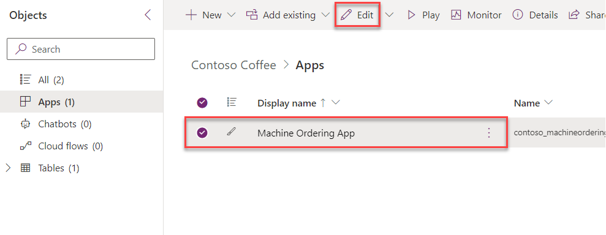](media/edit.png#lightbox)
    
3.  Select the **Data** icon from the navigation pane to display the current sources. Then, select the **\+ Add data** drop down.
    
4.  Select **Machine Orders** from the table list to include it as a data source for your app.
    
    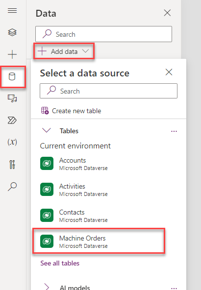
    

Task - Create the edit form
---------------------------

Next, you create the edit form by following these steps:

1.  Switch to the **Tree view** pane using the icons within the navigation pane, and then select the **Main Screen**.
    
    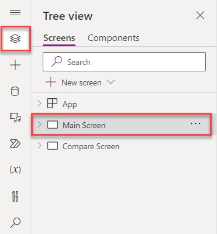
    
2.  Select a few machines. Press and hold the **Alt** key, which will allow you to select the compare checkbox.
    
    [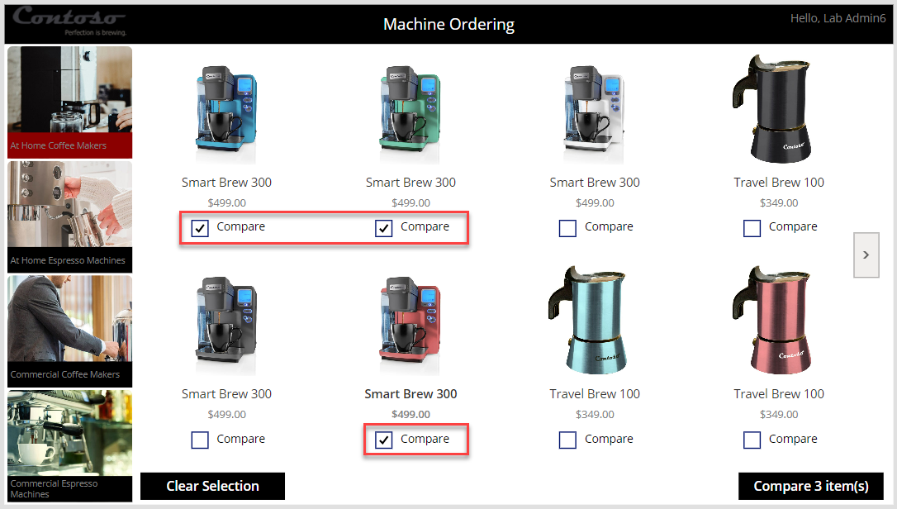](media/compare.png#lightbox)
    
3.  Select **Compare Screen** from the **Tree view**. The selected machines should now display.
    
    [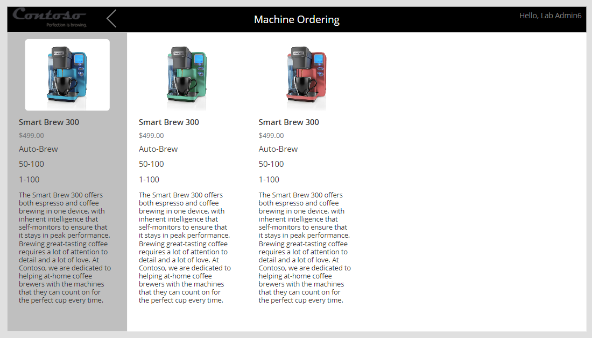](media/comparison.png#lightbox)
    
4.  Select the **\+ Insert** drop down from the tool bar, search for **edit**, and then select **Edit form**.
    
    [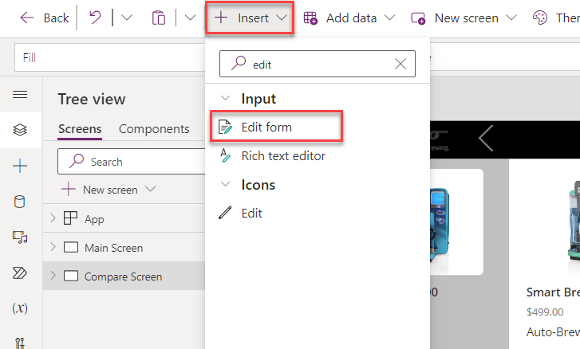](media/edit-form.png#lightbox)
    
5.  In the data pane to the right of the screen, select the **Data source** drop-down menu.
    
6.  Select the **Machine Orders** table as the data source.
    
    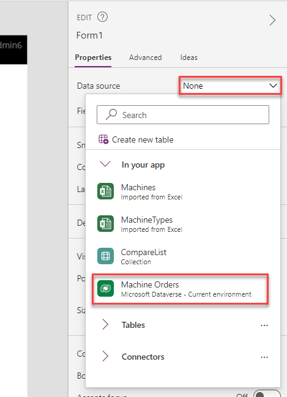
    
7.  Select **Edit fields**.
    
    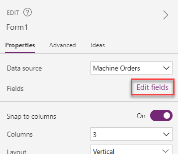
    
8.  Add, remove, and arrange fields as ordered in the following list. You can add the fields by using the plus (**+**) sign, and you can reorder them by dragging the field to the desired placement.
    
    1.  Machine Name
        
    2.  Price
        
    3.  Approver
        
    4.  Comments
        
    5.  Requested By
        
    6.  Request Date
        
    
    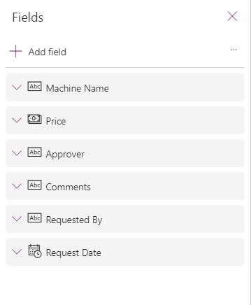
    
9.  Close the **Fields** pane.
    
10.  Rename the form as `Machine Order Form`.
    
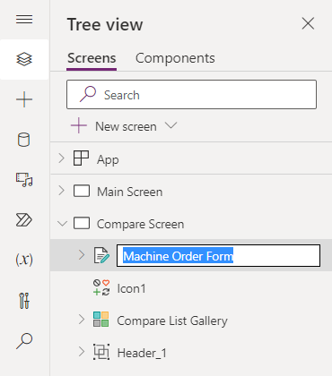
    
11.  Select the **Machine Order Form**.
    
12.  Set the **X** value to `900`.
    
13.  Set the **Y** value to `60`.
    
14.  Set the **Width** value of the **Machine Order Form** to `455`.
    
15.  Set the **Height** value of the form to `650`.
    
16.  Within the properties pane to the right of the screen, change the **Snap to columns** value to **1**. This setting modifies the layout of the edit form to be a single column.
    
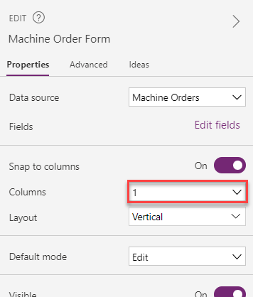
    
    The form should now resemble the following image.
    
[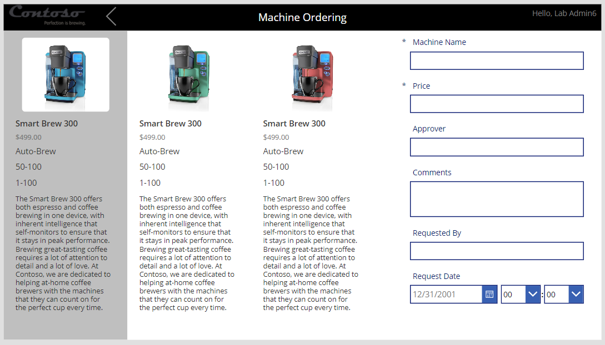](media/form.png#lightbox)
    
    Note
    
    You can always select controls, such as the **Form1** control, from the tree view on the left to make sure that you're selecting the correct control. To move it, make sure that you select the form and not a control within the form.
    
    
17.  To create a new instance of the form when the screen is loaded, select **Compare Screen** in left tree view pane.
    
18.  Select the **OnVisible** property of the screen and then enter the following formula:
    
    ```
    NewForm('Machine Order Form')
    ``
    
[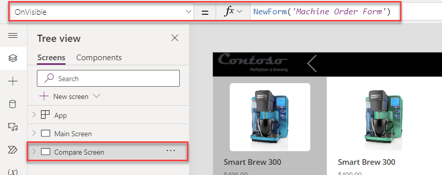](media/on-visible.png#lightbox)
    

Task - Set up the title column
------------------------------

In the next few steps, you set up each form field.

Your first task is to set up the title to display the machine type and machine name for the selected machine. For example, if the user selects the Smart Brew 300 coffee makers, you want the machine order to have the title of "At home coffee makers - Smart Brew 300."

1.  Expand the **Machine Name DataCard** under the **Machine Order Form** in the tree view.
    
    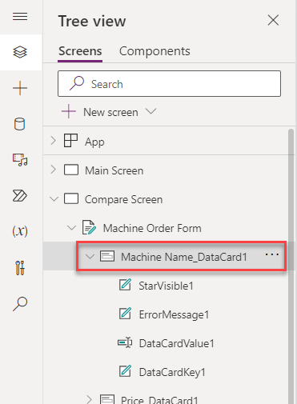
    
    The default card contains a few controls:
    
    *   **StarVisible1** - A label control that has an asterisk (\*) and has its **Visible** property set to **true** or **false**, depending on whether the field is required or not. Because the **Title** field was set as **Required** when you set up the table, its **Required** property is set to **true**.
        
    *   **ErrorMessage1** - A label that is directly below the main data entry field that displays error messages.
        
    *   **DataCardValue1** - The text input control where you can enter the title. For this scenario, you set the title based on the selected machine.
        
    *   **DataCardKey1** - The label that displays the title of the field.
        
    
    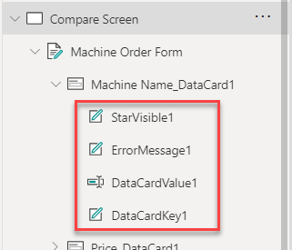
    
2.  Select **Machine Name DataCardValue** in the tree view. Then, select the **Advanced** tab from the pane to the right.
    
3.  Select **Unlock** so that you can customize the card.
    
    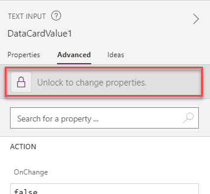
    
    Note
    
    For the next few steps, you'll use the Advanced pane to customize control properties within the form. You can perform the same customizations by using the property dropdown menu and formula bar in the upper left of the studio.
    
4.  Go to the **Data** section and set the **Default** property to:
    
    ```
    'Compare List Gallery'.Selected.'Machine Type' & " - " & 'Compare List Gallery'.Selected.'Machine Name'
    ```
    
    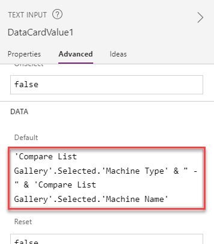
    
5.  Change the **DisplayMode** to `DisplayMode.View`. This setting prevents users from changing the value within the text box.
    
    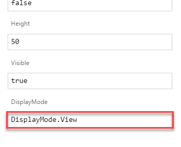
    

Task - Set up the Price field
-----------------------------

In this task, you set the price to the price of the item and then make it read-only.

1.  Expand **Price Data Card** for the Compare Screen within the Tree View pane.
    
    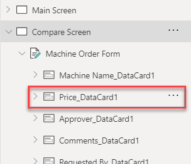
    
2.  Select the **Data Card Value**.
    
    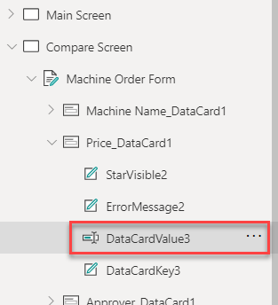
    
3.  Select the **Advanced** tab within the properties pane and then select **Unlock**.
    
    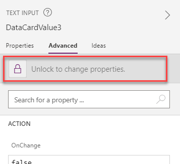
    
4.  Change the **Default** property in the **Data** section to:
    
    ```
    Text('Compare List Gallery'.Selected.Price,"$##,###.00")
    ```
    
    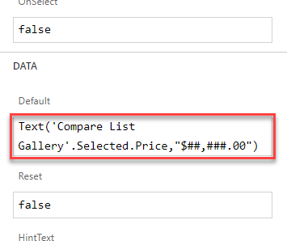
    
5.  Select the **Price Data Card** within the Tree View pane and change the **DisplayMode** property value to `DisplayMode.View` using the formula bar.
    
    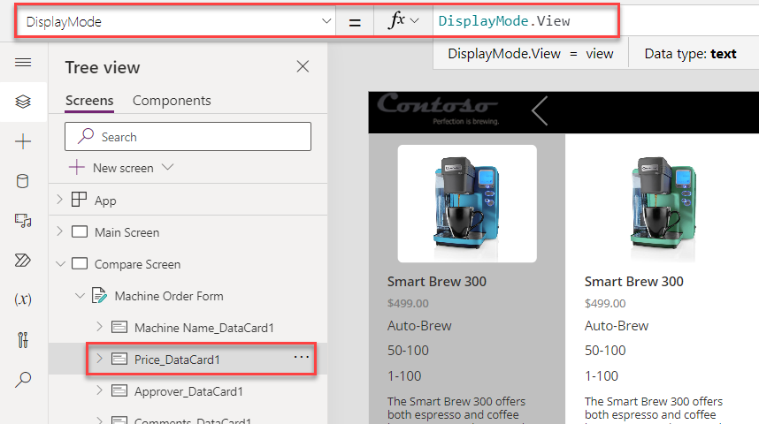
    

Task - Set up the Approval field
--------------------------------

In this task, you set the **default** value for the approver to be the email address of the signed-in user's manager.

You use Microsoft Graph to retrieve the manager's email.

1.  Select the **Data** icon from the navigation menu. Select the **\+ Add data** drop down and then expand **Connectors**. Select **Office 365 Users**.
    
    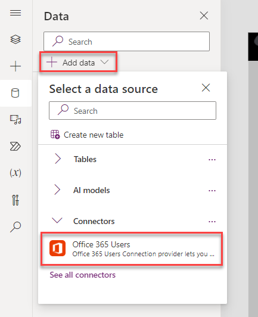
    
2.  When prompted, select **Connect**.
    
    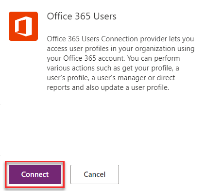
    
3.  Select the **Approver Data Card Value** within the Compare Screen from the Tree view pane.
    
    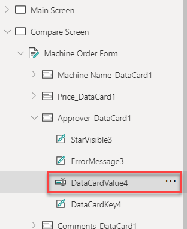
    
4.  Switch to the **Advanced** tab within the pane to the right of the screen, and select **Unlock**.
    
    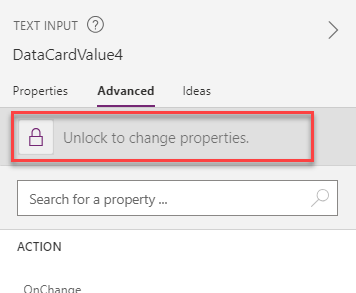
    
5.  Under the Data section, set the **Default** property value to:
    
    ```
    User().Email
    ```
    
    This expression uses your user's email so that you don't accidentally email your manager to approve your testing.
    
    In a real application, or if you wanted to try the expression to use your manager's email, it would be:
    
    ```
    Office365Users.Manager(User().Email).Mail
    ```
    
    The expression would make an API call at runtime to get the manager's email address of the signed-in user.
    
    If you try it and get an error when calling the **Office365Users.Manager()** function, it might be because a manager isn't set up in the system for the signed-in Office 365 user. In that case, you can return to **User().Email**.
    
6.  **Save** your work and return to continue editing the app.
    
The Office 365 User connector has access to many other valuable types of information.


Task - Set up the Comments field
--------------------------------

Your next task is to set up the **Comments** field by following these steps:

1.  Expand the **Comments** Data Card and select the **DataCardValue** within the Tree View pane.
    
2.  Under the Properties tab of the pane to the right of the screen, set the **Hint text** property to `Enter justification`.
    
    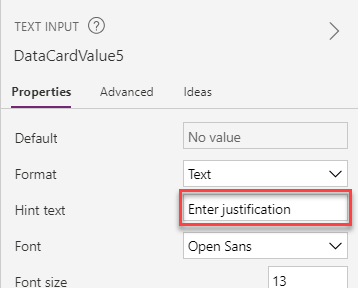
    

Task - Set up the Requested By field
------------------------------------

Next, you set the **Requested By** field to be the current signed-in user's email, and then you disable the control so that the user can't change this value.

1.  Expand the **Requested By** Data card from within the Tree view pane.
    
2.  Select the **DataCardValue**.
    
3.  Switch to the **Advanced** tab within the pane to the right of the screen and **Unlock** the card.
    
4.  Change the **DisplayMode** property to `DisplayMode.View`.
    
    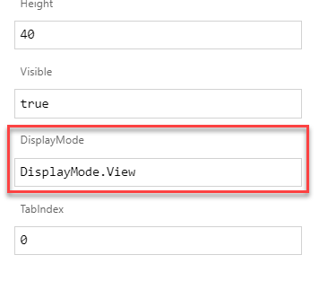
    
5.  Under the Data section within the pane, set the **Default** value to `User().Email`.
    
    The email of the currently signed-in user should display.
    
    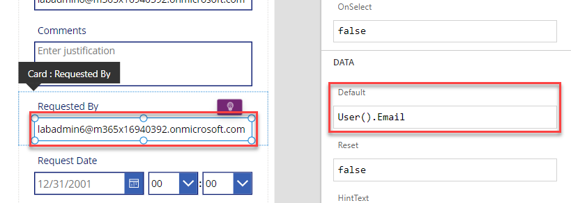
    

Task - Set up the Request Date field
------------------------------------

In this task, you set the **Request Date** field to be today's date.

1.  Expand the **Request Date** Data card from the Tree View pane.
    
2.  Select the **DateValue** card.
    
    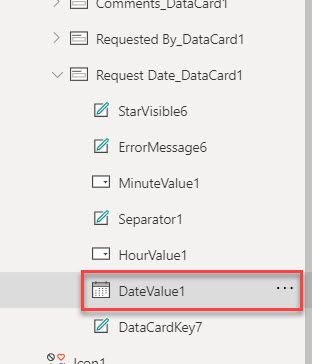
    
3.  Switch to the **Advanced** pane to the right of the screen and **Unlock** the card.
    
4.  Change the **DefaultDate** property to `Today()`.
    
    [](media/default-date.png)
    
    The date in the calendar control changes to today's date.
    
    Now, you hide the **Request Date** card. You don't need to show this field to the user. Because you've included it as part of the form, the field is updated as part of the form submit.
    
5.  Select the **Request Date DataCard** within the Tree View pane.
    
6.  Navigate to the **Properties** pane and set the **Visible** toggle to **Off**.
    
    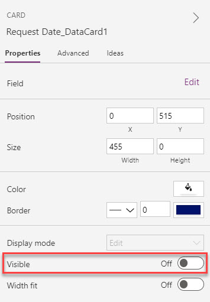
    

Task - Add a button to submit the form
--------------------------------------

To add a button to submit the form, follow these steps:

1.  Select the **Main Screen** within the Tree View pane.
    
2.  Copy (**Ctrl+C**) the **Compare** button from the first screen, which has the correct color values.
    
    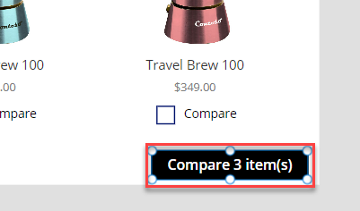
    
3.  Return to the **Compare Screen** and paste (**Ctrl+V**) the button.
    
    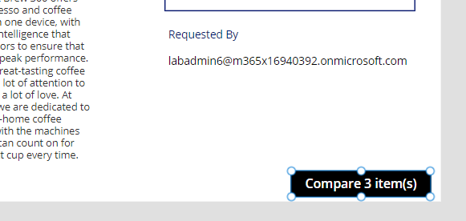
    
4.  Make sure that the button is larger and positioned correctly. You can resize to **260 x 40** by using the **Properties** pane on the right. You may also need to reposition the button on the screen. _Notice in the button in the image below has been positioned to 1090 (X value) and 720 (Y value)._
    
    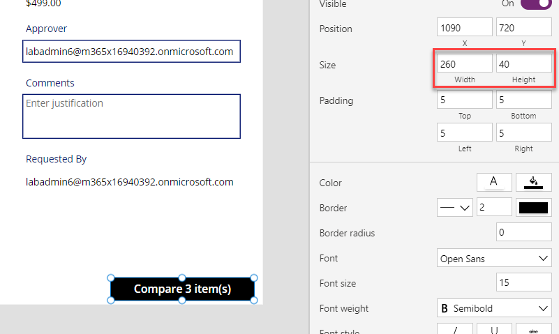
    
5.  Within the Tree view pane, rename the button to `Submit Button`.
    
6.  Using the formula bar, set the button's **Text** property to `"Submit machine request"`.
    
    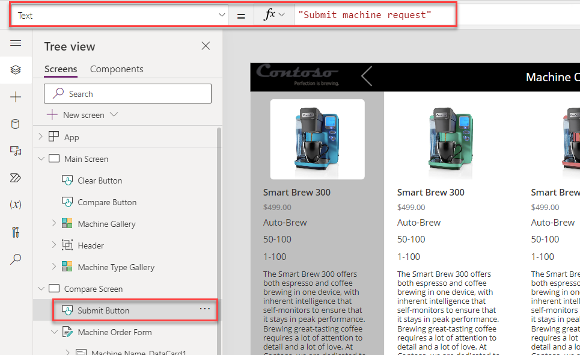
    
7.  The button should be enabled only if a machine is selected. To do so, change the button's **DisplayMode** property to:
    
    ```
    If(!IsBlank('Compare List Gallery'.Selected), DisplayMode.Edit, DisplayMode.Disabled)
    ```
    
    [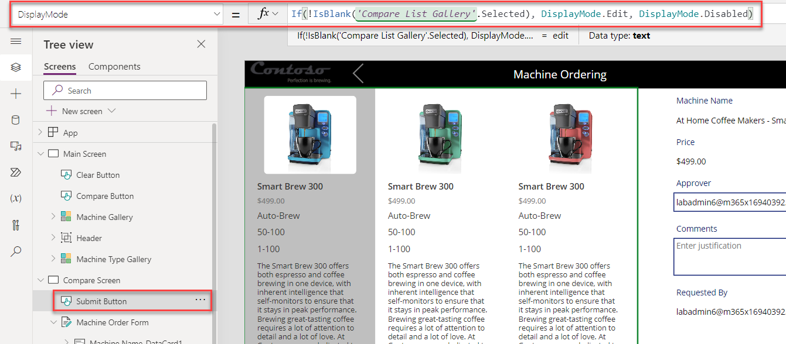](media/button-display.png#lightbox)
    
    Note
    
    You might notice the exclamation mark (**!**) in the formula `!IsBlank()`. Normally, if you only have `IsBlank()`, the check is for **blank** only. Adding the exclamation mark (**!**) in front of the formula will change it to check if it's **not blank**.
    
8.  Set up what you want to happen when the button is selected by setting the **OnSelect** property to the following:
    
    ```
    SubmitForm('Machine Order Form')
    ```
    
    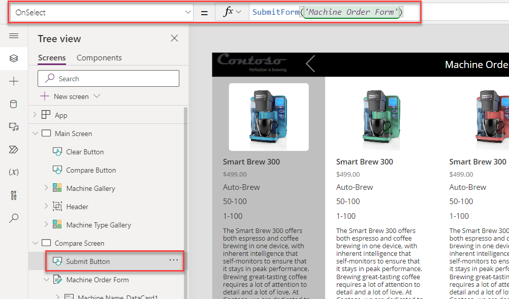
    
    When the button has been selected, the form data is submitted to Microsoft Dataverse.
    
9.  Save your work and then return to continue editing the app.
    

Task - Test the form
--------------------

Your next task is to test the form.

1.  Select the **Main Screen** within the Tree view pane. Then, select the **Preview the app** button.
    
    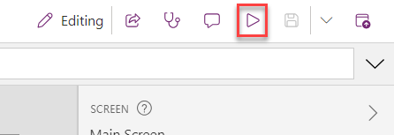
    
2.  Select a few machines to compare and then select **Compare**.
    
    [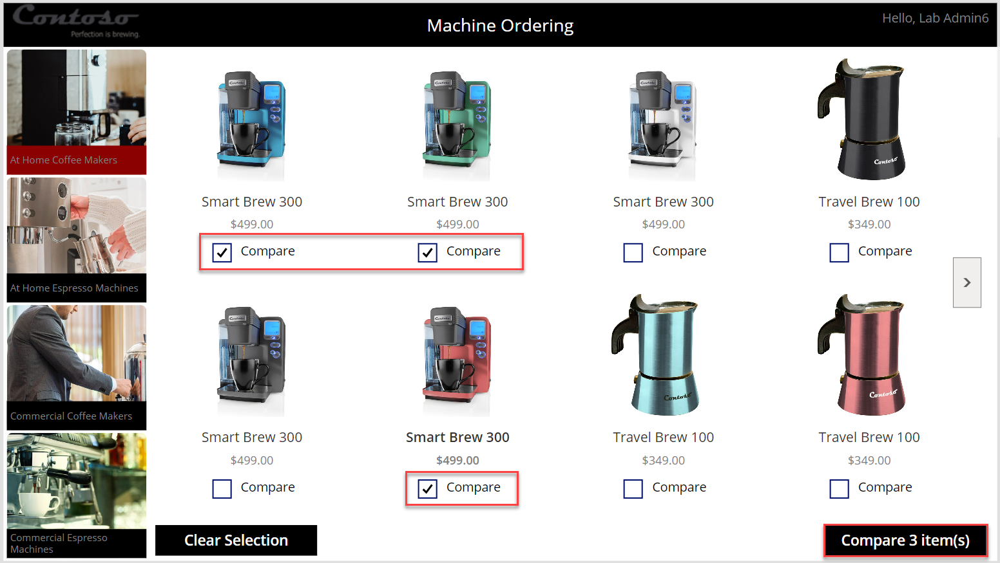](media/compare-three.png#lightbox)
    
3.  Select one of the machines.
    
    The **Machine Name**, **Price**, **Approver**, and **Requested By** fields will be filled in already.
    
4.  Add some **Comments**, such as: `This machine will satisfy our needs.`
    
5.  Select **Submit machine request**.
    
    [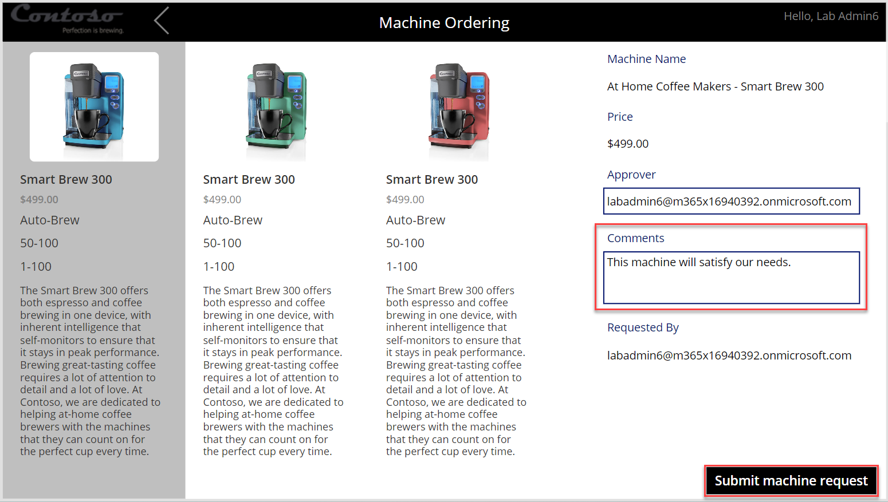](media/submit-machine.png#lightbox)
    
    The button should turn disabled (gray) for a few seconds while it's submitting the request. If it doesn't, an error has likely occurred. Select the **X** in the upper-right corner to return to the design mode.
    
    If an error has occurred, a yellow error icon displays next to the **Submit** button. You can hover your mouse cursor over the icon to check the error.
    
6.  Exit the preview mode by selecting the **X** in the upper-right corner.
    
7.  Select the **Publish** button located in the top right hand corner of the page.
    
8.  Select **Publish this version** and then wait for the application to be published.
    
    
    

Task - Verify that a new item was added to the Machine Order table
------------------------------------------------------------------

Your next task is to verify that a new item was added to the Machine Order table.

1.  Open a browser window and then go to [Make Power Apps](http://make.powerapps.com/?azure-portal=true).
    
2.  Select **Tables** from the navigation pane to the left for the screen.
    
3.  Select the **Machine Order** table.
    
    [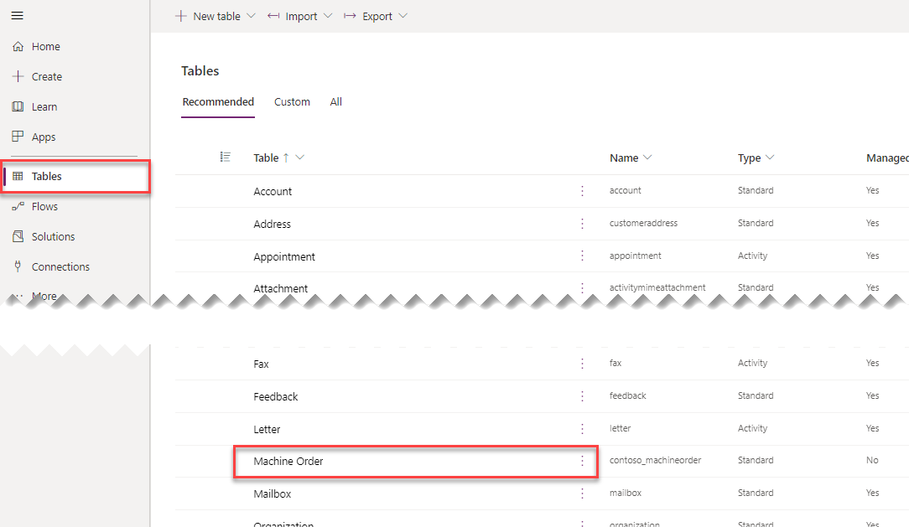](media/machine-order.png#lightbox)
    
    A newly added row with your machine order details should display. It might take a few seconds to load.
    
    [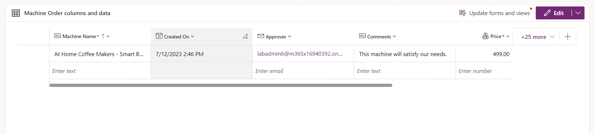](media/details.png#lightbox)
    

Optional task - Navigate to the confirmation screen after the form submission is successful
-------------------------------------------------------------------------------------------

This step is optional. If you're short on time, you may skip this step and continue to the next lab.

After the form has been successfully submitted, it's a good idea to show a confirmation screen and allow the user to return to the main screen.

1.  Open a browser window and then go to [Make Power Apps](http://make.powerapps.com/?azure-portal=true). Login in if needed.
    
2.  Within the navigation pane to the left of the screen, select **Apps**.
    
3.  Then, select **Machine Ordering App** and then choose **Edit** from the tool bar at top of the page.
    
4.  Within the Tree view pane, select the **\+ New screen** drop-down, and choose **Blank**.
    
    
    
5.  Rename the screen to `Submit Success Screen`.
    
    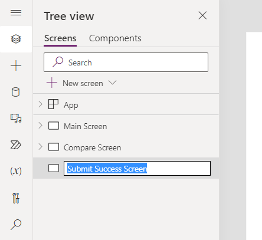
    
6.  Expand the **Compare Screen** within the Tree view pane.
    
7.  Select **Machine Order Form**.
    
8.  Set the **OnSuccess** property of the form to the following formula using the formula bar at the top of the screen:
    
    ```
    Navigate('Submit Success Screen', ScreenTransition.None)
    ```
    
    [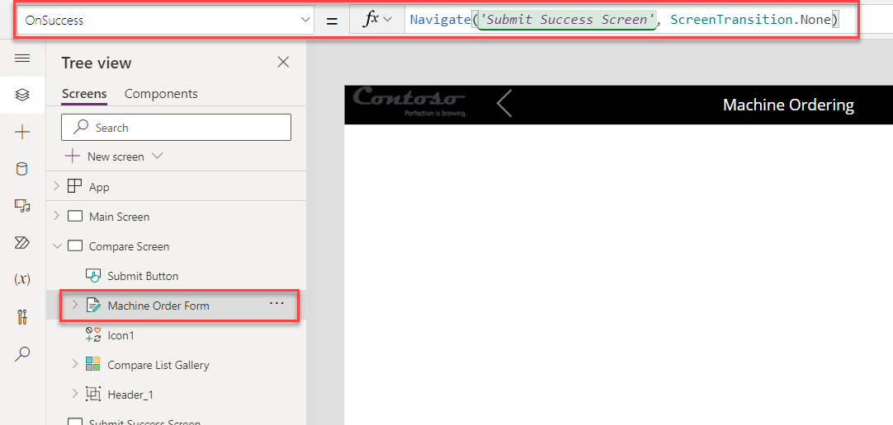](media/on-success.png#lightbox)
    
9.  Copy (**Ctrl+C**) the **Header** from the **Compare Screen**.
    
10.  Go to the **Submit Success Screen** and paste the header.
    
[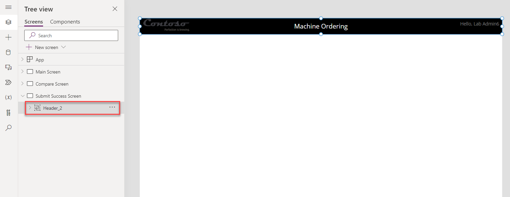](media/header.png#lightbox)
    
11.  Using the **\+ Insert** drop down from the tool bar at the top of the screen, add a **label** to the middle of the screen. Then, set the **Text** property value to the following:
    
    `"Your machine request has been successfully submitted. Thank you."`
    
12.  Using the tools at the top of the screen, change the **font size**, **alignment**, and **resize** the label as needed within the canvas. For this example, we changed the font size to `14`, the text alignment to **center**, and resized the visual as shown in the image below.
    
[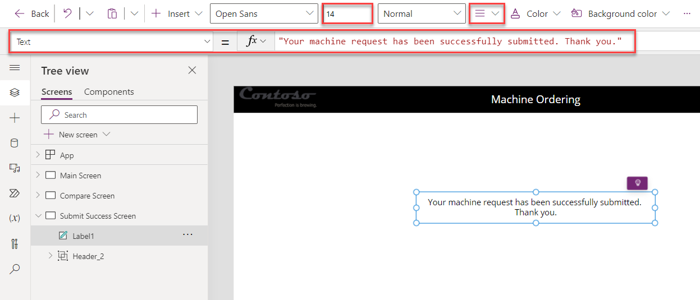](media/label.png#lightbox)
    
13.  Within the Tree view pane, copy the **Submit Button** from the **Compare Screen** and then paste it in the **Submit Success Screen**.
    
14.  Rename the button as `Success Button`.
    
15.  Change the **Text** property value of the **Success Button** to `"OK"` using the formula bar at the top of the screen.
    
16.  Change the **Display Mode** of the **Success Button** to `DisplayMode.Edit`.
    
17.  Reposition the button to the middle of the screen.
    
     Note : When pressed, the button should remove items from the **CompareList** collection and navigate to the main screen.
    
18.  Set the **OnSelect** property of the button to:
    
    ```
    Clear(CompareList);Navigate('Main Screen',ScreenTransition.None)
    ```
    
[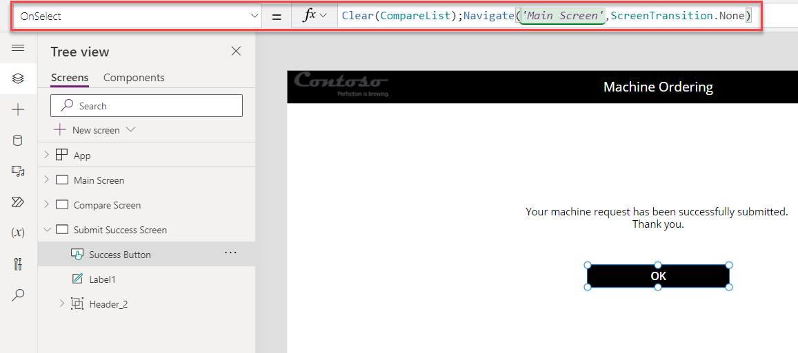](media/ok-button.png#lightbox)
    
    Note
    
    The semicolon (**;**) is used as a separator when multiple functions are called one after the other. If you're in a locale where the semicolon is used as a comma separator, then use a double semicolon (**;;**).
    
19.  Select the **\+ Insert** drop down at the top of the screen, searching for `display`, and then choose **Display form**.
    
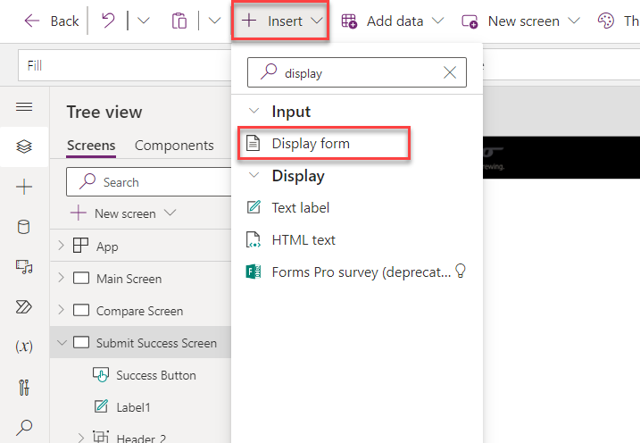
    
20.  Within the **Properties** pane to the right of the screen, set the form's **Data source** to the **Machine Orders** table.
    
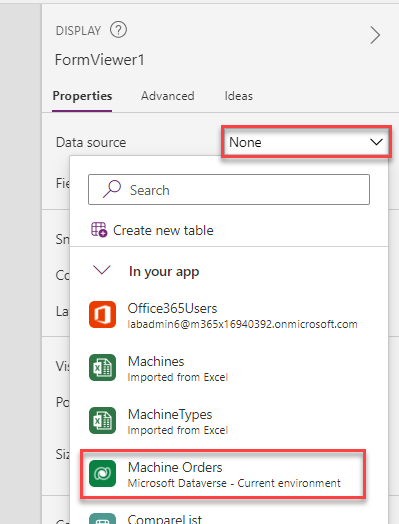
    
21.  Select **Edit Fields** below the Data source, and select the following fields to display: **Machine Name**, **Price**, **Comments**, **Approver**, **Requested By**, and **Request Date**. Rearrange and remove extra fields.
    
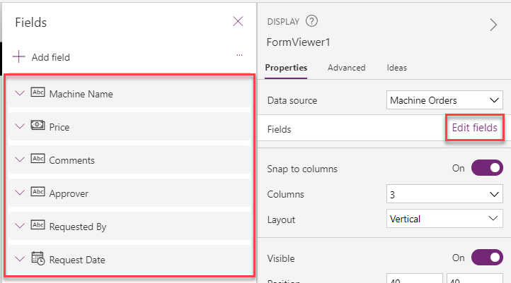
    
22.  Change the **Snap to columns** value to **1**.
    
23.  Change the **Layout** to **Horizontal**.
    
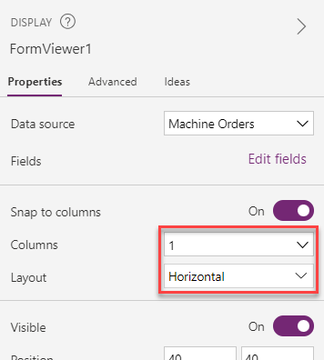
    
24.  Set the form's **Item** property value to the following formula:
    
    ```
    'Machine Order Form'.LastSubmit
    ```
    
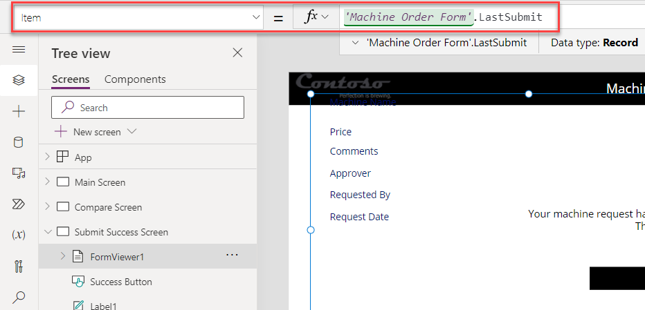
    
25.  Reposition and resize the form until it resembles the following image. The label is first on the screen, centered under the header. Position the view form to be centered under the label. Then, center the **OK** button at the bottom of the page under the view form.
    
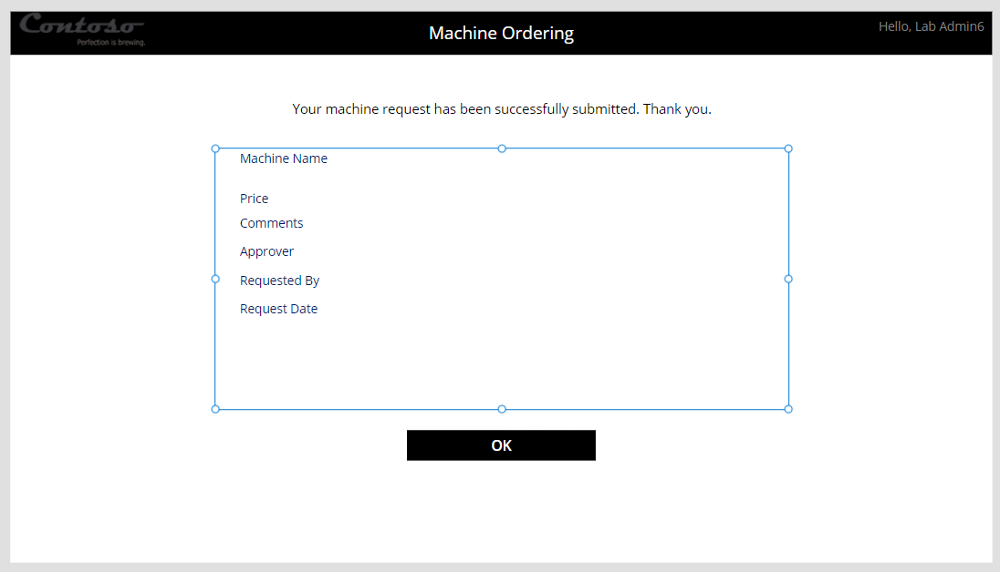
    
26.  Save your changes and **Publish**.
    
27.  Select the **Main Screen** and then select **Play**.
    
28.  Select a few machines and then select **Compare**.
    
[](media/compare-three.png#lightbox)
    
29.  Select one of the machines, provide a comment, and then select **Submit**.
    
[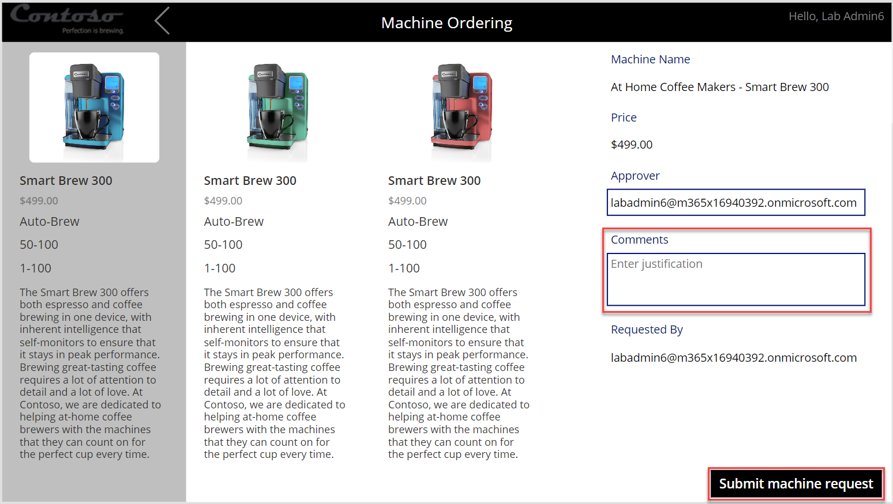](media/comment.png#lightbox)
    
30.  Verify that the confirmation screen shows the order details. Select **OK**.
    
[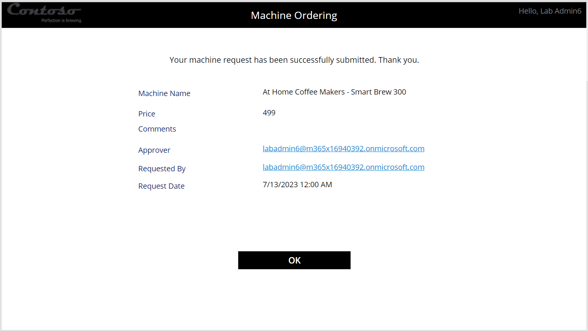](media/order-details.png#lightbox)
    
    The application returns to the main screen and the compare list will be cleared.
    
[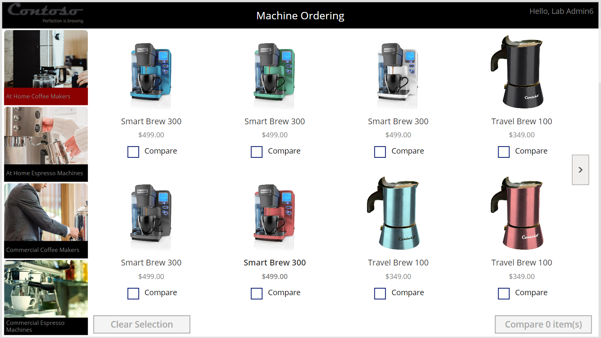](media/clear.png#lightbox)
    
31.  Close the application.
