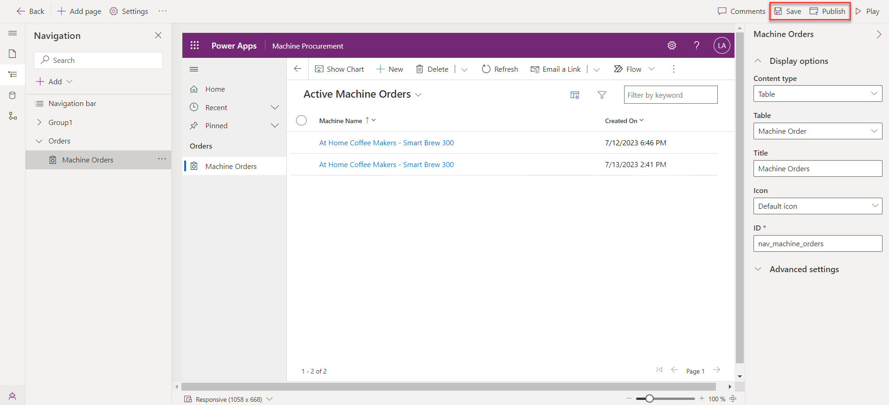

Exercise 1 - Create an app and add columns to the Machine Order table
===================================================================

In this exercise, you create a standalone model-driven application that uses the same Machine Order table that you created in Microsoft Dataverse.

Task: Create an application
---------------------------

Your first task is to create a model-driven application. This application serves as a container to identify all components that make up the application. It will also include a site map that defines the custom navigation that people use to navigate between the components (table views, dashboards, and other visual components).

1.  Go to [Make Power Apps](https://make.powerapps.com/?azure-portal=true) and select the environment that you created.
    
2.  Select **Solutions** and then open the **Contoso Coffee** solution.
    
3.  Select the **\+ New** drop down from the tool bar at the top of the screen and then select **App > Model-driven app**.
    
    
    
4.  In the **New model-driven app** form, enter `Machine Procurement` in the **Name** field and then select **Create**.
    
    
    
    Next, you build a site map for the application. The completed site map should resemble the following image.
    
5.  Select the **Navigation** icon within the pane to the left of the screen. Then, select the **(...)** drop down and choose **New Group**.
    
    
    
6.  Go to the **Display options** section of the pane to the right of the screen, enter `Orders` in the **Title** box and `nav_ordersgroup` in the **ID** box.
    
    Note
    
    The properties panel on the right will only show if you select **New Group** on the left.
    
    
    
7.  Select the **ellipsis** (...) next to the **Orders** group from the Navigation pane and select **New page**.
    
    
    
    Note
    
    The properties panel on the right will only show if you select **New page** on the left.
    
8.  Within the **New Page** dialog, select **Dataverse table**.Select **Next**.
    
    
    
9.   Search for the **Machine Order** table and select it. Then click on **Add**.

10.  Within the **Machine Orders** pane to the right of the screen, under the **Display options** section, enter `nav_machine_orders` in the **ID** box.
    

    
The application should now resemble the following image. Select **Save** and **Publish**.
    

    
12.  Select the **Back** button to navigate back to your solution.
    

    

Task: Add procurement columns to the Machine Order table
--------------------------------------------------------

In this task, you add new columns to the Machine Order table. The columns that you'll add will support the business process flow, which you'll build in the next exercise. When you use a business process, it consists of stages, which you can consider major milestones in completing the work. Each stage has one or more steps. These steps help users keep track of what they need to do before advancing to the next stage. Steps are simply columns on the table. To accelerate the process of creating the business process in this task, you'll first create the columns that you need.

To support this scenario, you add the following columns to the table:

*   **Capital Approved** - You use this column in the flow to capture that the machine order has received capital approval.
    
*   **Send Survey** - You use this column in the final stage. Currently, the team plans on manually sending a survey to determine how the user's ordering experience was, and they'll manually verify this fact after they've sent the survey. However, the team wants a future update to automate sending a survey in a future release.
    

1.  Go to [Make Power Apps](https://make.powerapps.com/?azure-portal=true).
    
2.  Select **Solutions** and then open the **Contoso Coffee** solution.
    
3.  Select **Tables** and then open the **Machine Order** table.
    
    
    
4.  Select **\+ New > Column**.
    
    
    
5.  Enter `Capital Approved` in the **Display name** field, select **Choice**, then **Yes/No** from the **Data type** dropdown menu, and then select **Save**. A **Yes/No** data type is used in this case because, when you use it as a step in the business process, you want the ability to mark it as completed. The **Yes/No** column type is similar to a true or false column.
    
    
    
6.  Create four more **Yes/No** columns and name them **Machine Received**, **Machine Configured**, **Send Survey**, and **Machine Delivered**.
    
    
    
    
    
    
    
    
    
7.  Add another column with the name of `Supplier Order ID`, select **Single line of text** from the **Data type** dropdown menu, select **Text** from the **Format** menu, and then select **Save**. Notice that you're not making this column required. You make it a required column in the business process later in the lab.
    

