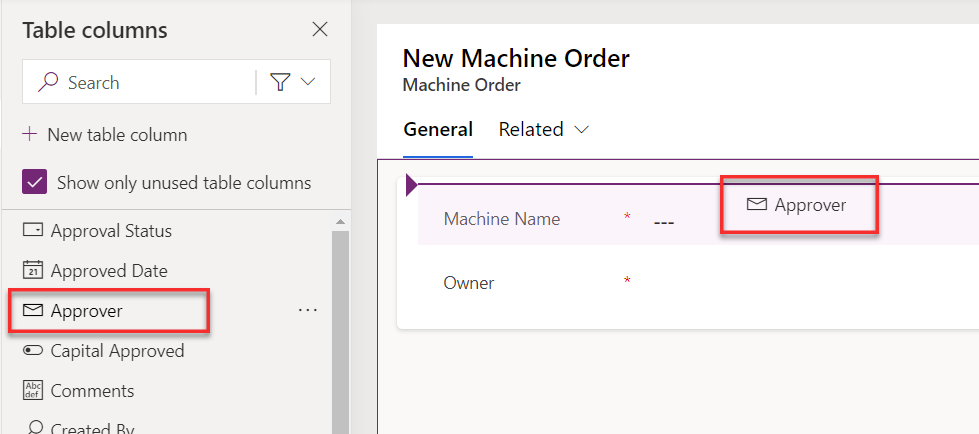

Exercise - Modify the form and view
===================================

In this exercise, you modify the Machine Order form to add other columns. When you create a table in Microsoft Dataverse, it also creates a main form for that table with a few basic columns on it. In addition to the form, views are created for the table. Views are used in a model-driven app whenever a list of the table rows are displayed. You would modify the view to add more columns or change the placement. You can also create other views. For example, you might provide a view to show all machine requests that are waiting to be received.

Note

To complete the exercises, you'll need to use a few files. Download the [Student files](https://github.com/MicrosoftDocs/mslearn-developer-tools-power-platform/raw/master/in-a-day/AIAD/AppinADayStudentFiles.zip) for use in this lab.

Task: Modify the form
---------------------

To modify the form, follow these steps:

1.  Select **Solutions** and then open the **Contoso Coffee** solution.
    
2.  Select **Tables** and then open the **Machine Order** table.
    
    
    
3.  Go to the **Data experiences** section and select **Forms**.
    
    
    
4.  Select the **Information Main** form and then select **Edit > Edit in new tab**.
    
    
    
5.  If you're required to sign in again, do so.
    
6.  From the **Table columns** pane to the left of the screen, search for the **Approver** column and then drag it to the form.
    
7.  Place the **Approver** column above the **Machine Name** column.
    
    
    
8.  The new form designer lets you reposition columns. Drag the **Approver** column and place it between the **Machine Name** and **Owner** columns.
    
9.  The new form designer lets you cut and paste columns. Select the **Approver** column and then select the **Cut** button.
    
10.  Select the **Owner** column and then select **Paste**.
    

    
    The **Approver** column is moved to the bottom.
    

    
11.  Select **Save and Publish**.
    

    
12.  Close the **Form Designer** tab.
    
13.  Select **Done**.
    

Task: Modify the view
---------------------

To modify the view, follow these steps:

1.  Select **Solutions** and then open the **Contoso Coffee** solution.
    
2.  Select **Tables** and then open the **Machine Order** table.
    
3.  Go to the **Data experiences** section and select **Views**.
    
    
    
4.  Open the **Active Machine Orders** option.
    
    
    
5.  Select the **Approval Status** column once (you don't need to double-click).
    
    
    
    The new column is added to the view.
    
    
    
6.  Select the **\+ View column** button.
    
    
    
7.  Select **Estimated Ship Date**.
    
    
    
8.  Add **Price** and **Status** to the view.
    
    
    
9.  Select **Save and Publish**.
    
10.  Then, select the **Back** button.
    

