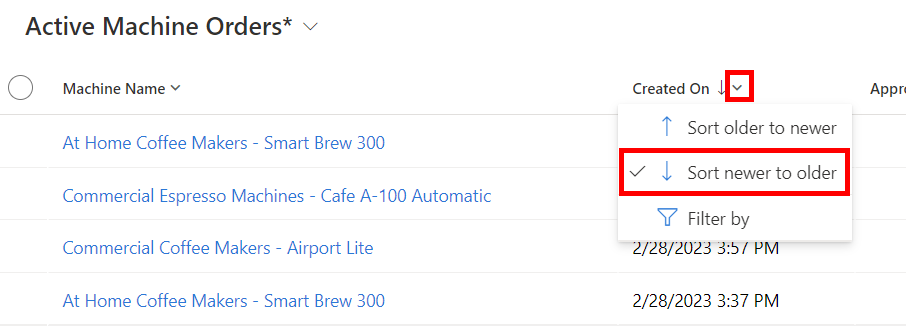

Exercise - Test the application
===============================

In this exercise, you test the application that you built.

Note

To complete the exercises, you'll need to use a few files. Download the [Student files](https://github.com/MicrosoftDocs/mslearn-developer-tools-power-platform/raw/master/in-a-day/AIAD/AppinADayStudentFiles.zip) for use in this lab.

Task: Test the application
--------------------------

To test the application, follow these steps:

1.  Select **Apps**, select the **Machine Procurement** application, and then select **Play**.
    
    
    
    The application should start, and the **Active Machine Orders** view should load.
    
    Note
    
    If your data doesn't show in the list, run the Machine Ordering canvas app that you built and then submit some orders.
    
    
    
2.  Start a new web browser instance and then go to [Make Power Apps](https://make.powerapps.com/?azure-portal=true). Don't close the model-driven application.
    
3.  Select **Apps**, select the Machine Ordering application that you created in lab 2, and then select **Play**.
    
4.  Select two machines. Make sure that one of the machines is priced over $10,000 and then select **Compare**.
    
    
    
5.  Select the machine with the price over $10,000 and then select **Submit machine request**.
    
    
    
6.  Select **OK**. If you didn't choose to create the submission success screen in a previous lab, this option won't exist. You need to complete steps 3 and 4 again and then move to step 8.
    
    
    
7.  Select two more machines and then select **Compare**.
    
8.  Select a machine with a price under $10,000. Provide an approver email (or leave in the autopopulated manager email) and then select **Submit**.
    
    
    
9.  Return to the model-driven application that you created and refresh the view. Sort the orders by the **Created On** column from newer to older. The two machines that you ordered by using the Power Apps canvas app should display.
    
    
    
10.  Open the machine name record that's priced over $10,000.
    
    The business process flow should now have five stages because this order costs more than $10,000 and needs **Capital Approval**.
    

    
11.  Navigate back to the **Machine Orders**.
    
12.  Select the other recent order that you created that is priced below $10,000.
    
13.  The business process flow for this order should have four stages because this order doesn't require **Capital Approval**.
    

Summary
=======

A model-driven app from Power Apps uses Microsoft Dataverse as its data source and presents users with a common experience that's built around the data. The app that you've built for Contoso Coffee allows their office staff to manage the requests that have been submitted by users in the canvas app.
