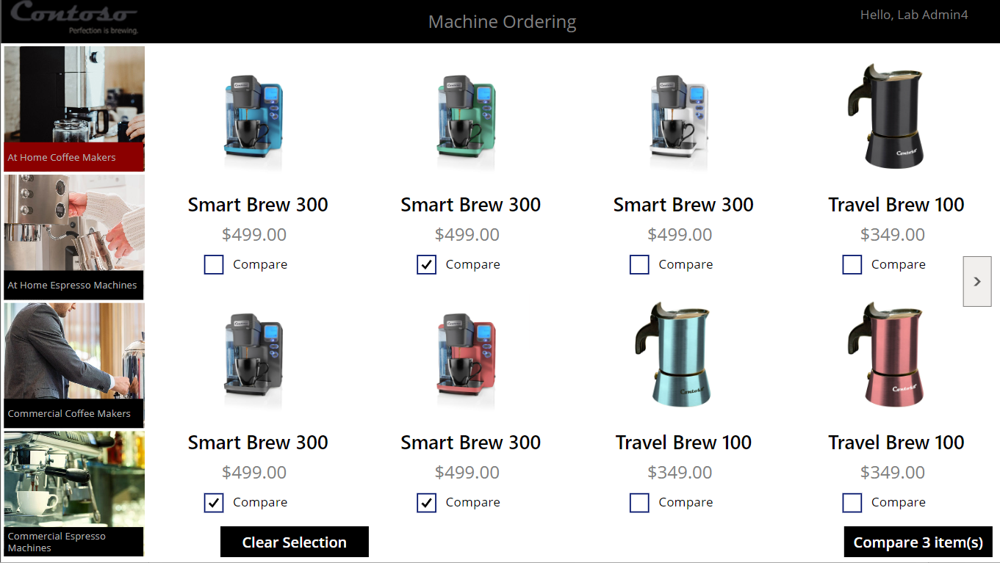
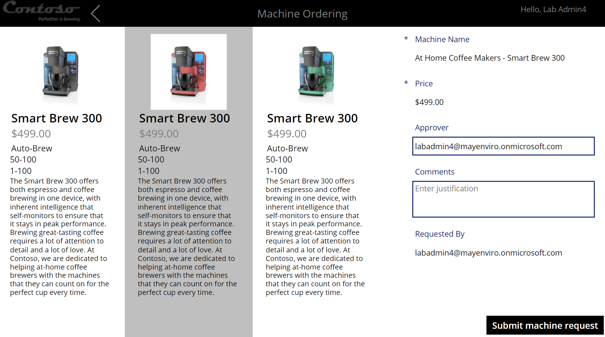

Integrate a Power Apps app with Power Automate - Virtual Lab
================================================================

*   lab
*   5 Units

In this lab, you'll create a flow that uses the Modern Approvals service to automate the approval workflow. It will send an email to the selected approver and take an action based on their response.

Learning objectives
-------------------

In this lab, you'll:

*   Create a flow that's triggered when a new Microsoft Dataverse row is created.
*   Automate sending approval requests.
*   Customize the approval based on the Microsoft Dataverse row.
*   Use the Approval center.

Prerequisites
-------------

You should already have an app with these two screens:

It's recommended to complete each Lab in sequence of the virtual labs

This lab is a component of the "Power App Program" instructor-led course. A licensed user environment is obligatory for participating in these exercises. Ensure that you've completed the setup steps as previously outlined. Download the Microsoft Excel file necessary for the forthcog exercises.

*   Introduction 
    
*   Exercise - Create an approval request flow
    
*   Exercise - Create conditional logic
    
*   Exercise - Test the cloud flow 
    
*   Exercise - Update the flow

Introduction
============

This lab includes the following five exercises.

Exercise - Create an approval request flow
------------------------------------------

The flow triggers when a new item is added to the Machine Order table in Microsoft Dataverse.

Exercise - Conditional logic
----------------------------

In Microsoft Power Automate, you can add conditions to take different actions depending on a certain result, in this case, whether the request was approved or rejected.

Exercise - Test the cloud flow
------------------------------

To test the flow, you run the Machine Ordering app and submit an approval request. Next, you verify that the request was sent to the approver and then approve the request. Then, you verify that the Microsoft Dataverse record was updated and that an email was sent back to the requestor.

Exercise - Update the flow
--------------------------

In this exercise, you add two actions to the "if no" branch.
