Exercise 1 - Create an approval request flow
==========================================

The flow triggers when you add a new item to the **Machine Order** table in Microsoft Dataverse.

*   It uses the Approvals Service to send an approval request.
    
*   The approver receives an email with options to approve or reject and to add comments.
    
*   After the approver has responded, the record in the Machine Order table will be updated with the appropriate approval status and comments.
    
*   An email is sent to the requester informing them whether the machine was approved or rejected.
    

Note

Two ways to create a flow are from blank or from a template. In this lab, you'll create the approval flow starting with a blank flow.

Note

To complete the exercises, you'll need to use a few files. Download the [Student files](https://github.com/MicrosoftDocs/mslearn-developer-tools-power-platform/raw/master/in-a-day/AIAD/AppinADayStudentFiles.zip) for use in this lab.

Task - Sign in to the Power Apps website and create a flow
----------------------------------------------------------

Your first task is to sign in to the Microsoft Power Apps website and then create a flow.

1.  Go to [Make Power Apps](https://make.powerapps.com/?azure-portal=true) and make sure that you're in the correct environment.
    
    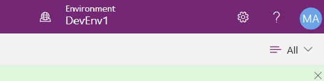
    
2.  Select **Solutions** and then select to open the **Contoso Coffee** solution.
    
3.  Select **New** and then select **Automation > Cloud flow > Automated**.
    
    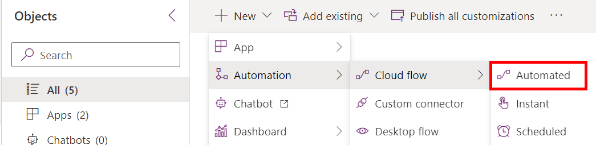
    

Task - Set up the trigger
-------------------------

Next, you need to set up the trigger, that is, when the flow should run. You can trigger a flow in the following ways:

*   Manually, from a Power Apps application
    
*   Manually, from a flow button
    
*   On a fixed schedule
    
*   When an event occurs, such as a new item being added to a table, a new email arriving in a user's inbox, or a new tweet being posted on Twitter that meets certain conditions
    

In this scenario, you set the flow to trigger when a new item is added to the **Machine Order** table in Microsoft Dataverse.

1.  In the **Flow name** box, enter a name for your flow, such as `New machine approval request`.
    
2.  In the **Choose your flow's trigger** box, search for `when a row is added` and then select **When a row is added, modified, or deleted**.
    
    [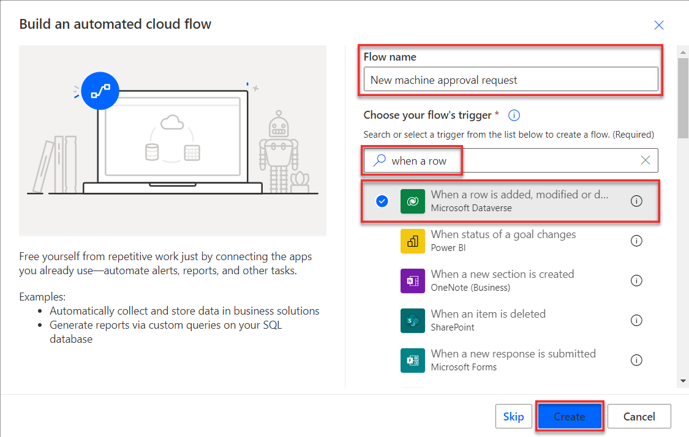](media/record-add.png#lightbox)
    
3.  Select **Create**.
    
4.  Select **Added** from the **Change type** dropdown menu.
    
    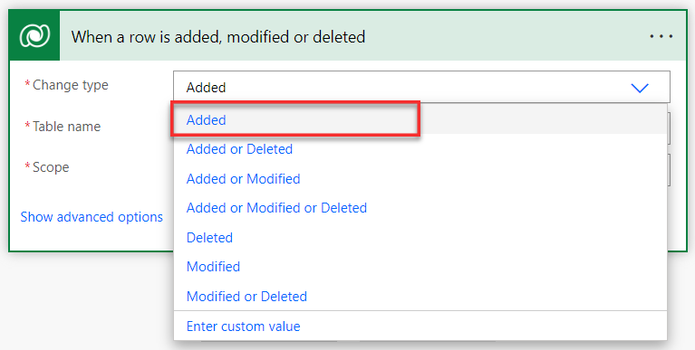
    
5.  From the **Table Name** dropdown menu, select **Machine Orders**. You can type `machine orders` to search for it.
    
6.  From the **Scope** dropdown menu, select **Organization**. Scope allows you to limit when your flow runs. For example, if you choose **User**, the flow would only run for orders that you create. In this case, you're choosing **Organization** because you want this flow to run for records that have been created by anyone in your entire organization.
    
    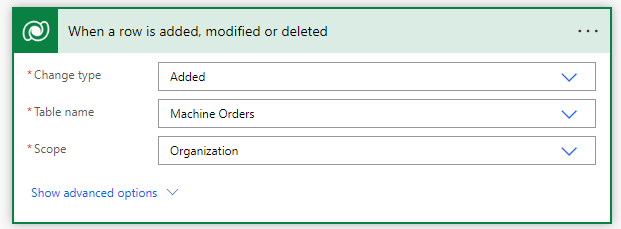
    

Task - Add an action to send an approval request
------------------------------------------------

In this next task, you'll add an action to send an approval request.

1.  Select **New step**.
    
    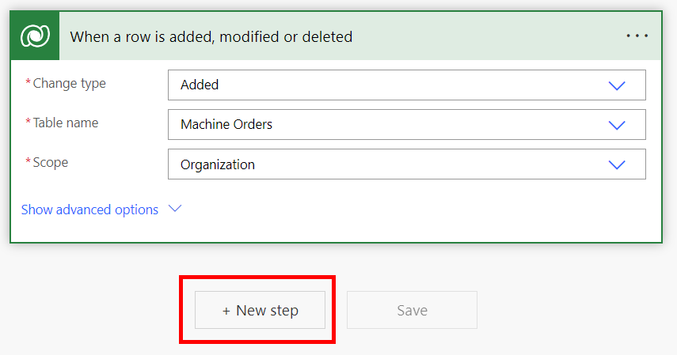
    
2.  Search for `Approvals` and then select **Start and wait for an approval**.
    
    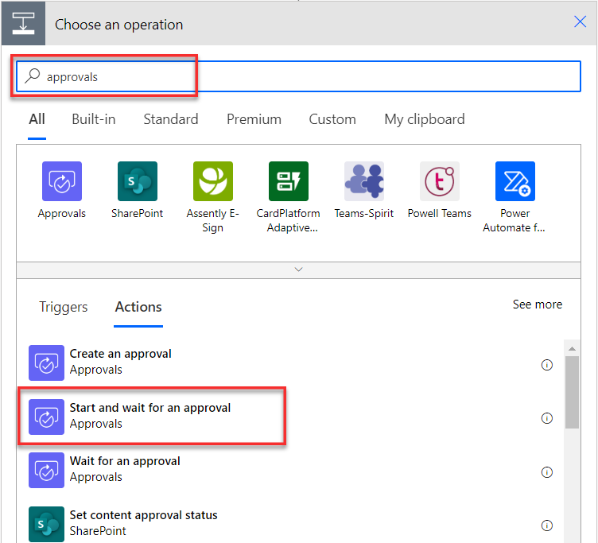
    
    The system uses the approval service.

3.  In the **Approval type** dropdown menu, select **Approve/Reject - First to respond**.
    
    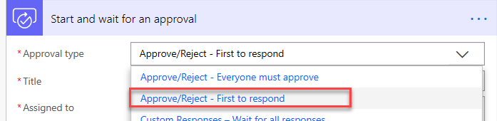
    
4.  In the **Title** field, add some text and one piece of dynamic content. This dynamic content contains the Machine Name of the machine order request. Enter `New machine request for` in the **Title** text box.
    
5.  Select **Machine Name** from the **Dynamic content** pane. (Ensure that you include a space between the word "for" and the Machine name)
    
    [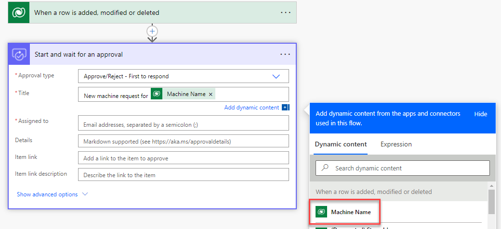](media/machine-name2.png#lightbox)
    
    Note
    
    If the **Dynamic content** box is not visible, select the **Add dynamic content** button.
    
    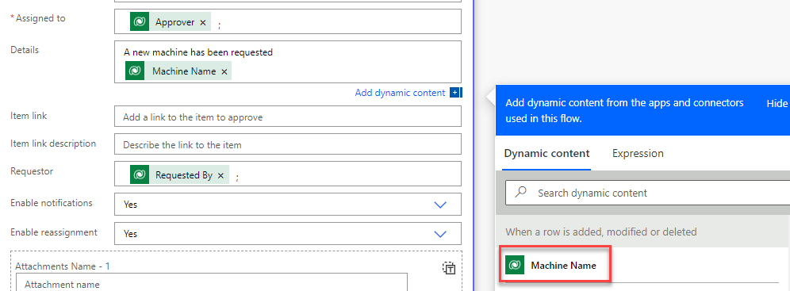
    
6.  Select the **Assigned to** field and then select **Approver** from the Dynamic content pane. Select the **Add dynamic content** button to show/hide the **Dynamic content** pane.
    
    [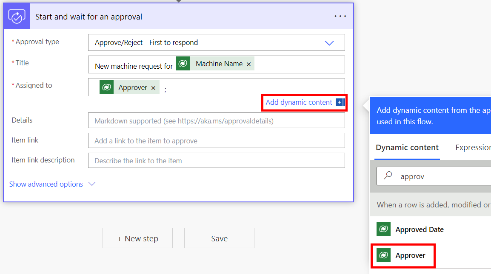](media/assigned-field.png#lightbox)
    
    Note
    
    Recall from the previous lab that this address is the approver's email address.
    
7.  Select **Show advanced options**.
    
    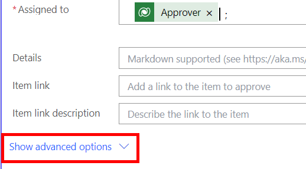
    
8.  Select the **Requestor** field and then select **Requested By** from the Dynamic content pane.
    
    [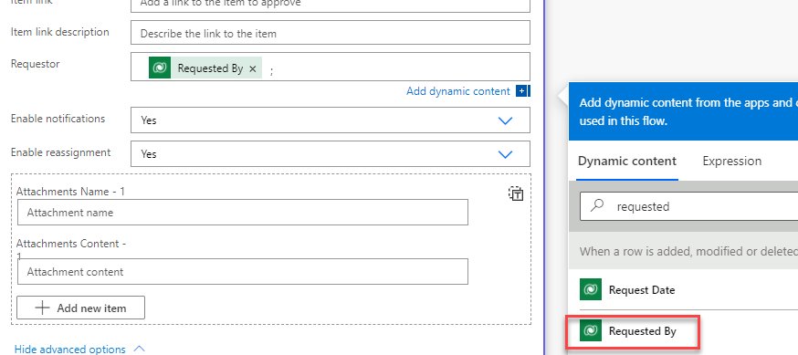](media/requestor.png#lightbox)
    
9.  In the **Details** field, enter `A new machine has been requested` and then press the **Enter** key.
    
10.  Select **Machine Name** from the **Dynamic content** pane.
    

    
11.  Type `, $` and then select **Price.** You might need to select the **See More** option under the dynamic content search bar to find the **Price** option.
    
[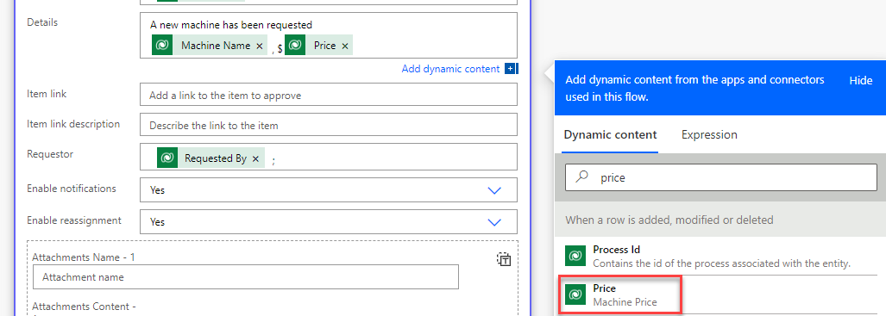](media/price2.png#lightbox)
    
12.  Press the **Enter** key and then type `Department Contribution: $`.
    
13.  Then, select **Department Contribution** from the Dynamic content pane.
    
[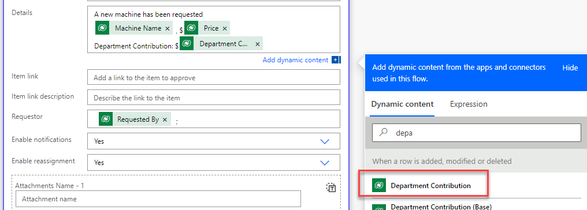](media/department.png#lightbox)
    
14.  Press the **Enter** key, and then type `Comments:` and select **Comments**.
    
[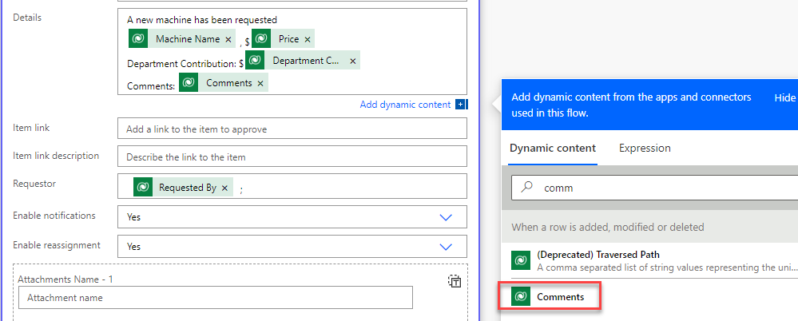](media/comments.png#lightbox)
    
    Your flow will now resemble the following image.
    
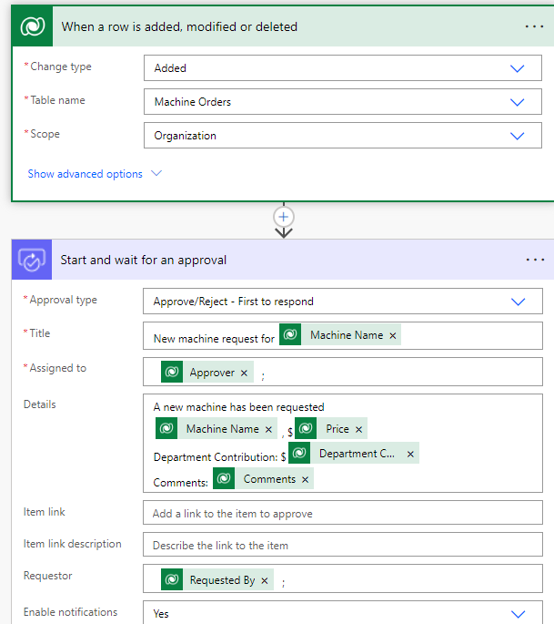
    
15.  **Save** your flow.
    
