Exercise - Create conditional logic
===================================

In Power Automate, you can add conditions to take different actions depending on a certain result, in this case, to indicate whether the request was approved or rejected.

Note

To complete the exercises, you'll need to use a few files. Download the [Student files](https://github.com/MicrosoftDocs/mslearn-developer-tools-power-platform/raw/master/in-a-day/AIAD/AppinADayStudentFiles.zip) for use in this lab. 

Task - Add conditional logic to the flow
----------------------------------------

In this task, you add conditional logic to the flow by following these steps:

1.  Select **New step** after the last action you previously added.
    
    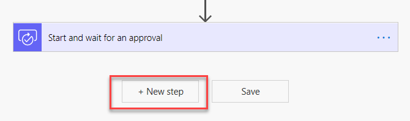
    
2.  Search for and then select **Condition**.
    
    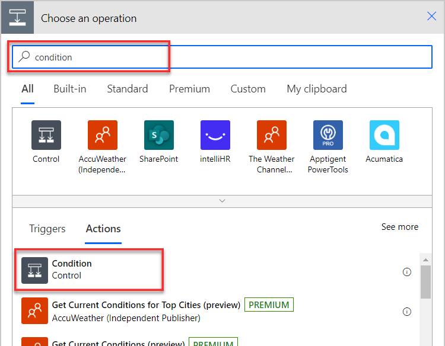
    
3.  Select the **Choose a value** box and select **Outcome** from the **Dynamic content** pane. You might need to select the plus (**+**) icon below the edit box to hide the **Dynamic content** pane.
    
    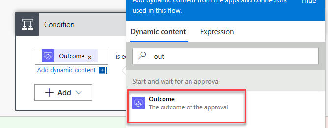
    
4.  Select **is equal to** for the condition and then type `Approve` for **Value**.
    
    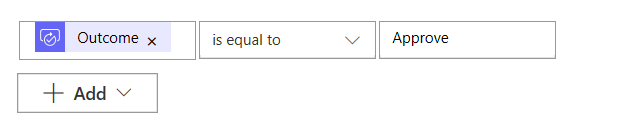
    

Task - Add conditional logic to the flow
----------------------------------------

Now, you set up what actions to perform if the response is approved or not: YES branch vs. NO branch.

You add two actions:

*   Update the record in the **Machine Order** table.
    
*   Send an email to the employee who requested the machine.
    

Follow the steps to add the actions.

1.  In the left **If yes** box, select **Add an action**.
    
    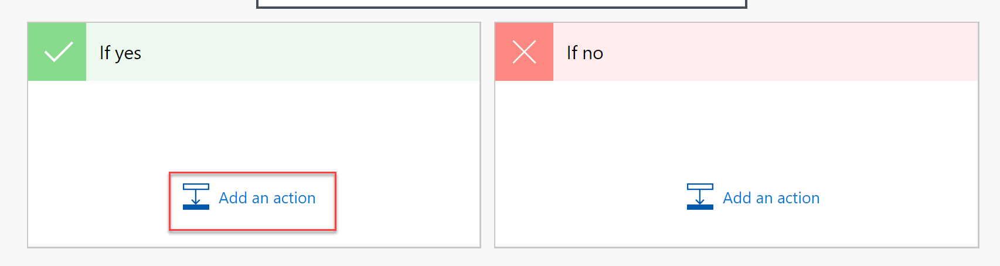
    
2.  Search for `Update a Row` and select **Update a Row Microsoft Dataverse**.
    
    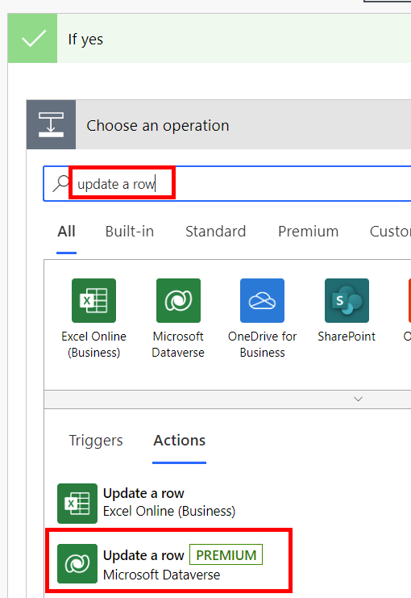
    
3.  Select **Machine Orders** from the **Table name** dropdown menu.
    
4.  Select the **Row ID** and then select **Machine Order** from the **Dynamic content** pane.
    
    [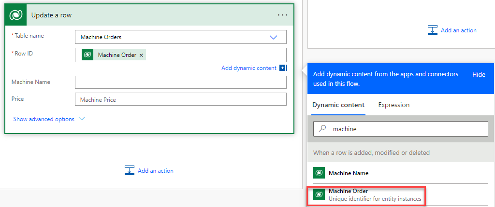](media/row.png#lightbox)
    
    Every time you create a table in Dataverse, a column is automatically created with the same name of the table. This column serves as the unique lookup ID for the record (or row) that was created.
    
5.  Select **Show advanced options**.
    
6.  Select **Approve** from the **Approval Status** dropdown menu.
    
    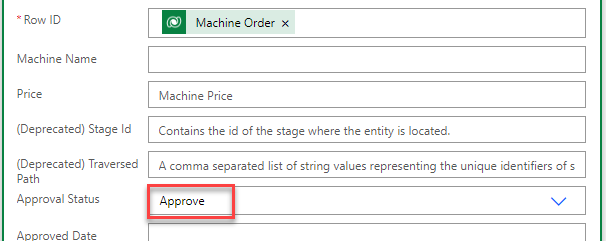
    
7.  Select the **Approved Date** field and then select the **Expression** tab within the Dynamic content pane.
    
    [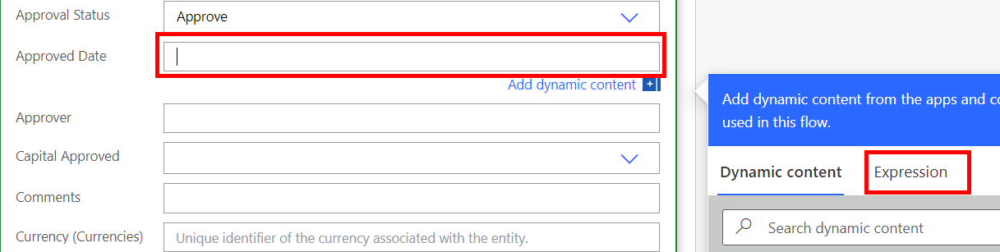](media/expression.png#lightbox)
    
8.  Type `utcNow()` and then select **OK**.
    
    [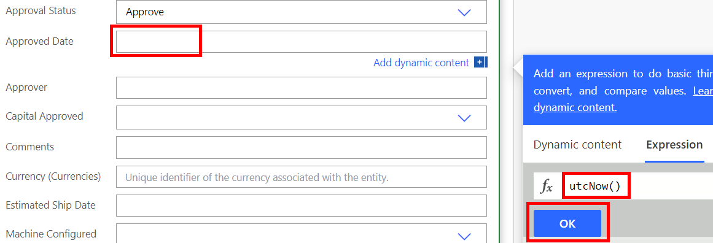](media/approved.png#lightbox)
    
9.  Save the flow.
    

Task - Add another action
-------------------------

Your next task is to add the send email action to the **If yes** branch.

1.  From within the **If yes** branch, select **Add an action**.
    
    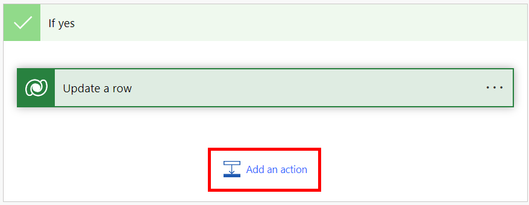
    
2.  Search for `send email` and select **Send an email (V2) - Office 365 Outlook**.
    
    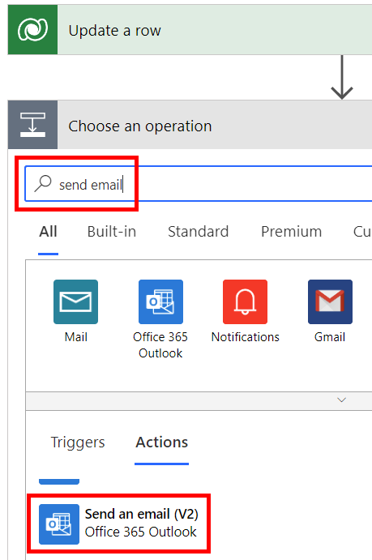
    
3.  Select **Sign in** if prompted.
    
    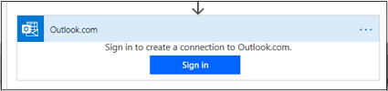
    
4.  Select **Accept**.
    
    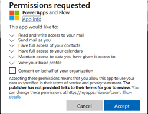
    
5.  Select the **To** field and then select **Switch to Advanced Mode**.
    
    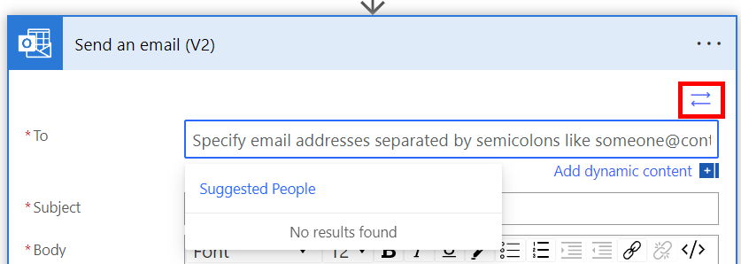
    
6.  Select **Requested By** from the Dynamic content pane for the **To** field. Select from under the **When a row is added** action.
    
    [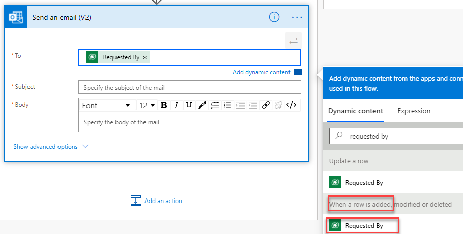](media/requested.png#lightbox)
    
7.  In the **Subject** field, enter `Your machine order has been approved!`
    
8.  Select the **Code View** button within the **Body** field.
    
    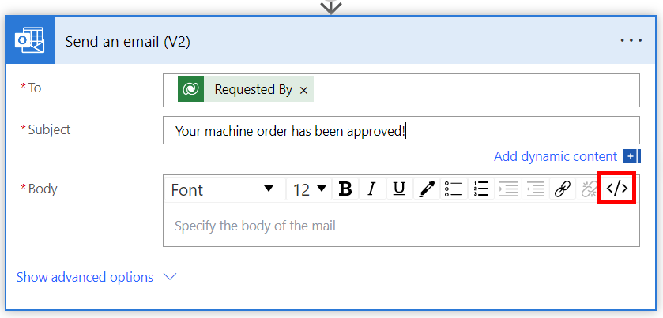
    
9.  Set the **Body** value as follows:
    
    `Your machine has been approved <b>@{outputs('Update_a_row')?['body/contoso_machinename']}</b> `
    
    `Estimated ship date: @{outputs('Update_a_row')?['body/contoso_estimatedshipdate']} `
    
    `@{outputs('Start_and_wait_for_an_approval')?['body/responseSummary']}`
    
    Select **Machine Name** and **Estimated Ship Date** from the **Update a row** action.
    
    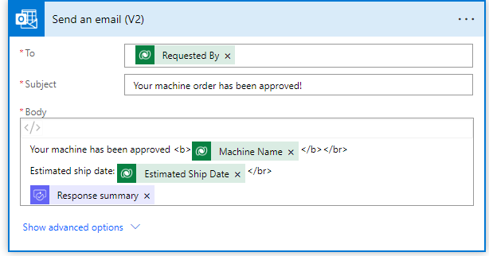
    
    Note
    
    If you don't have a Microsoft Office 365 mailbox set up, you can use another connector to send the email, such as Outlook.com, Gmail, or SendGrid.
    
10.  Select **Save**.
