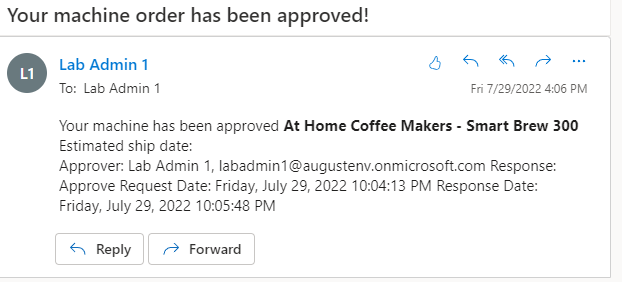

Exercise 3 - Test the cloud flow
==============================

Note

To complete the exercises, you'll need to use a few files. Download the [Student files](https://github.com/MicrosoftDocs/mslearn-developer-tools-power-platform/raw/master/in-a-day/AIAD/AppinADayStudentFiles.zip) for use in this lab.

To test the flow, you complete the following tasks:

1.  Run the Machine Ordering app and submit an approval request.
    
2.  Verify that the request was sent to the approver.
    
3.  Approve the request.
    
4.  Verify that the Microsoft Dataverse record was updated and that an email was sent back to the requestor.
    

Task - Test the cloud flow
--------------------------

Note

When a new machine record is added to the Machine Order table in Microsoft Dataverse, it might take up to 10 minutes for the flow to trigger. To ensure that the flow runs immediately, select the **Test** option in the upper right, select the **Manually** option, and then submit a machine request. The flow should run immediately.

A warning might display in the Flow checker that Power Automate Approvals has not been installed for your environment. Run the flow to initiate the provisioning of Power Automate Approvals.

To test the cloud flow, follow these steps.

1.  Select **Test** in the upper right-hand corner of the flow designer. Select **Manually** and then select **Test**.
    
    
    
2.  To submit a machine request, go to [Make Power Apps](http://make.powerapps.com/?azure-portal=true).
    
3.  Select **Apps** and then start the **Machine Ordering** app.
    
4.  Select a few machines and then select **Compare**.
    
    
    
5.  Select one of the machines and then provide an email address in the **Approver** field.
    
    
    
6.  Provide a comment and then select **Submit machine request**.
    
7.  Select **OK**.
    
8.  The flow will run and send email to the manager email that you provided. The request for approval email resembles the following image. It includes **Machine information**, **Price**, **Department Contribution (the calculated field)**, and the **Requester Comment**.
    
    Important
    
    If the flow doesn't run immediately, make sure that you wait for it. It might take up to 10 minutes for the flow to be triggered. To ensure that the flow runs immediately, refer to a previous note. Select the **Test** option in the upper right, select the **I'll perform the trigger action** option, and then submit a machine request. The flow should run immediately. However, the email might take a few minutes to appear, regardless of when the flow starts.
    
    
    
9.  Select **Approve**.
    
10.  Add a comment and then select **Submit**.
    

    
    The flow continues to run; it updates the row and sends an email to the requestor. The email that's sent to the requester will resemble the following image.
    

    
11.  Check the flow. Notice that the flow is now marked as **Succeeded** in the run history.
    

