Exercise 4 - Update the flow
==========================

In this exercise, you add two actions to the **If no** branch.

Note

To complete the exercises, you'll need to use a few files. Download the [Student files](https://github.com/MicrosoftDocs/mslearn-developer-tools-power-platform/raw/master/in-a-day/AIAD/AppinADayStudentFiles.zip) for use in this lab.

Task - Add actions
------------------

To add actions, follow these steps:

1.  If you don't already have the flow open, open it in **Edit** mode.
    
    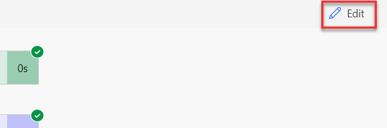
    
2.  In the **If no** branch, select **Add an action**.
    
    [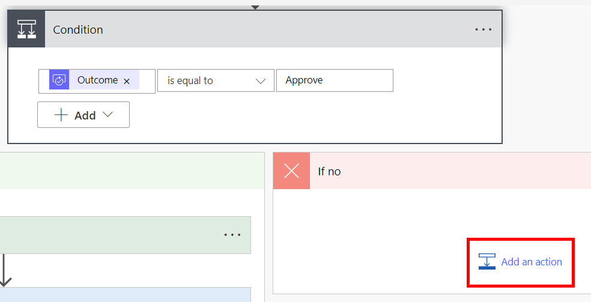](media/action-button.png#lightbox)
    
3.  Search for `Update a Row` and select **Update a Row (Dataverse)**.
    
    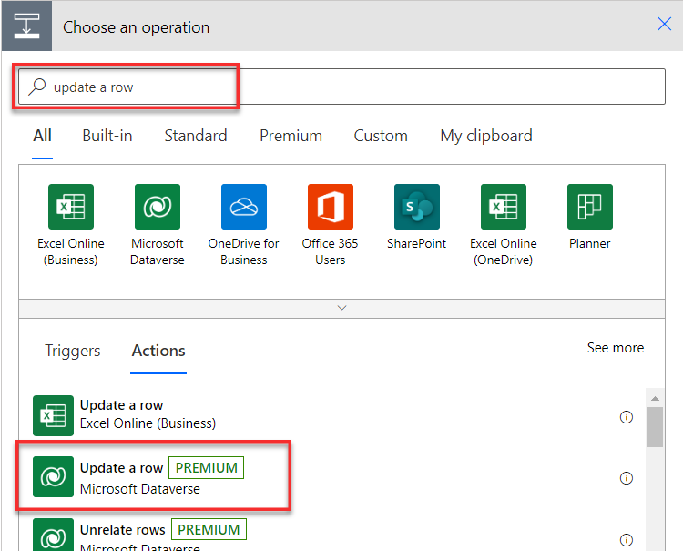
    
4.  Select **Machine Orders** from the **Table name** dropdown menu, select **Machine Order** for **Row ID**, and then select **Show advanced options**.
    
    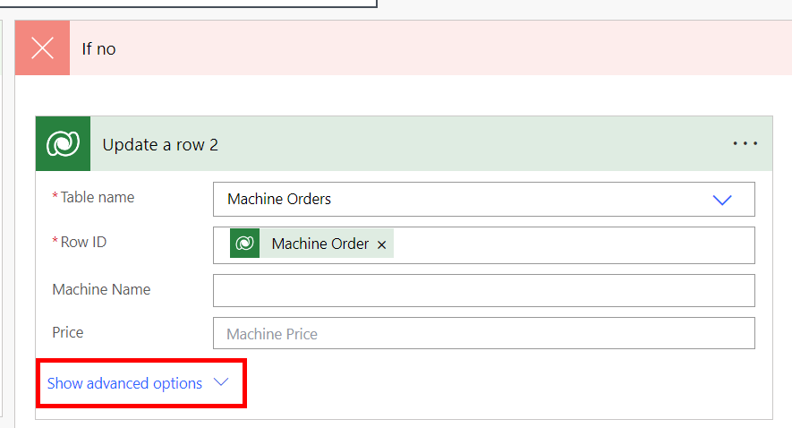
    
5.  Select **Reject** for the **Approval Status**.
    
    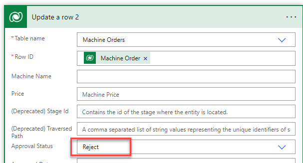
    
6.  Select **Add an action**.
    
7.  Search for `send email` and then select **Send an email (V2) - Office 365 Outlook**.
    
    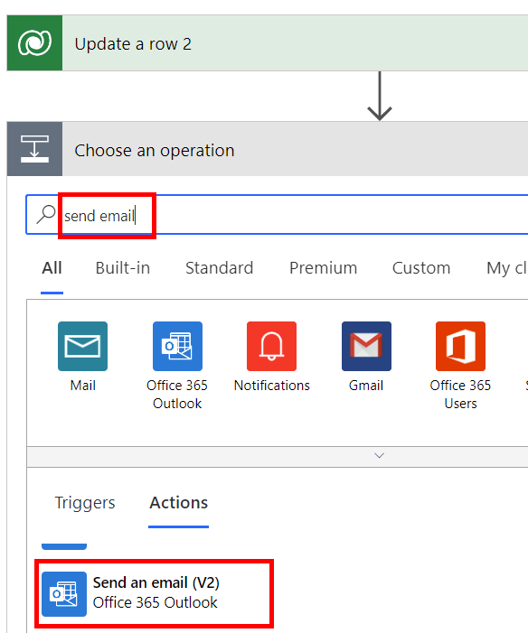
    
8.  Select the **To** field and then select **Requested By** from the **Dynamic content** pane.
    
9.  Enter `Your machine was not approved` in the **Subject** field.
    
10.  Type `Sorry, your request for` in the body and then select **Machine Name** from the **Dynamic content** pane.
    
11.  Type `was NOT APPROVED` after the machine name.
    
12.  Select **Response summary** from the **Dynamic content** pane.
    
    The email should now resemble the following image.
    
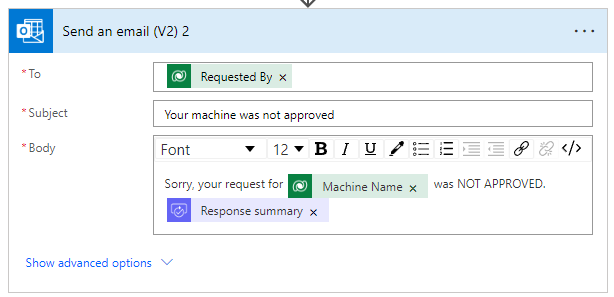
    
13.  **Save** the flow.
    

Task - Test the updated flow
----------------------------

To test the updated flow, follow these steps:

1.  Select **Test** in the upper right of the flow editor and then select **Manually** to start the flow.
    
2.  Run the Machine Ordering app. Select a machine and then submit an approval request.
    
3.  You should receive an email with options to **Approve** or **Reject** the request. Select **Reject** this time and then enter some comments, such as "`Machine no longer available.`" When you're finished, select **Submit**.
    
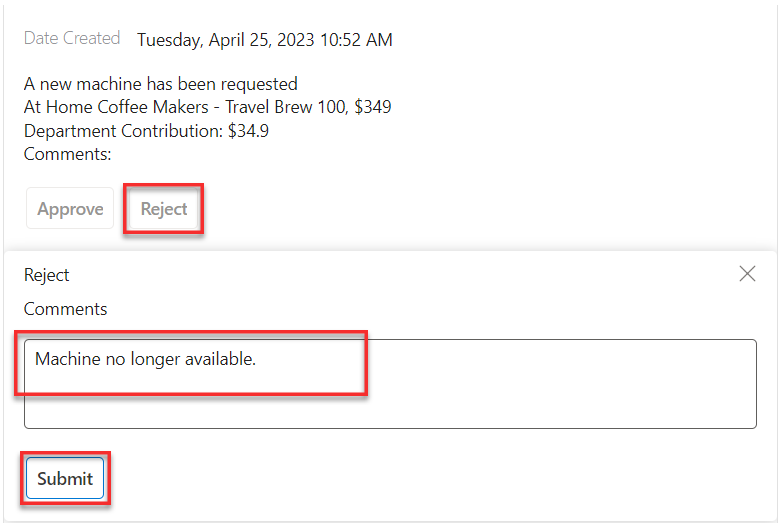
    
4.  Confirm that the requestor has received an email informing them that their machine approval request was rejected.
    
    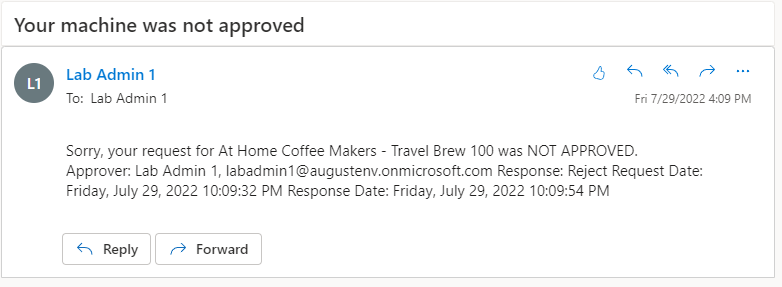
    
5.  Go to [Make Power Apps](https://make.powerapps.com/?azure-portal=true), select **Apps**, and then start the **Machine Procurement** application.
    
    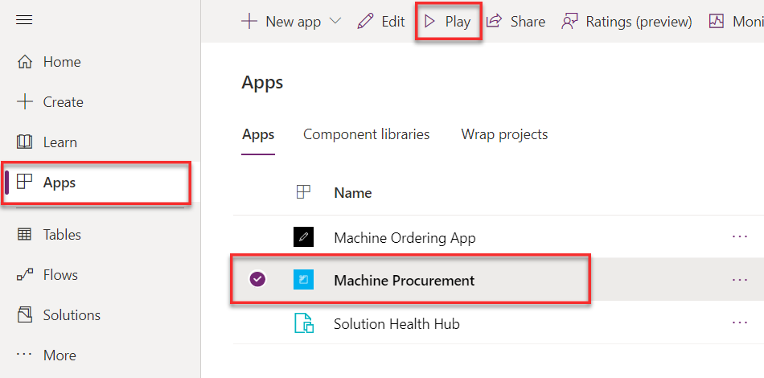
    
6.  Machine Orders will now show the Approval Status column.
    
    [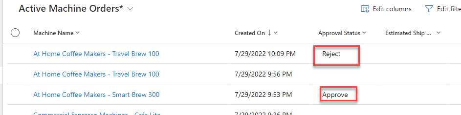](media/status.png#lightbox)
    

Task - Go to the approval center
--------------------------------

To access the approval center, follow these steps:

1.  Use the Machine Ordering app to submit a few more approval requests.
    
2.  Go to [Power Automate](https://flow.microsoft.com/?azure-portal=true), make sure that you're in the correct environment, and then sign in with your lab credentials if prompted.
    
3.  In the left-hand pane, select **Approvals**.
    
    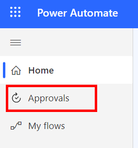
    
    All pending approval requests should be visible.
    
4.  Approve or reject a request from this screen. The details are displayed in the right pane, where you can **Add a comment** and **Confirm**.
    
    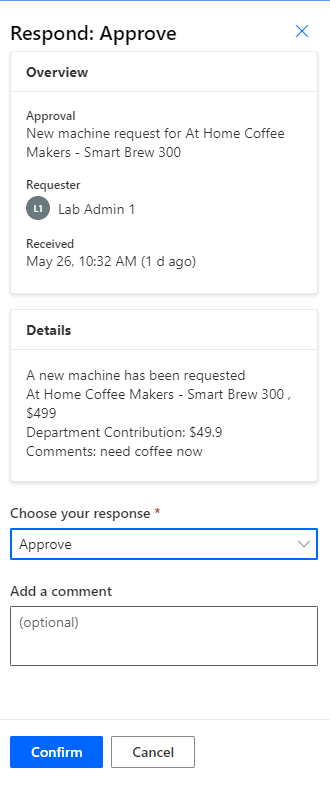
    
    The request will no longer be visible because it's been processed.
    
    Note
    
    All approval requests that are sent to the current signed-in user will be visible in the approval center, including approvals that are sent from any app or flow.
    
5.  You can also use the approval center to view all requests that you've sent and are awaiting response from the approver. Select the **Sent requests** tab in the upper part of the screen to view all requests that you've sent.
    
6.  Open the Power Automate mobile app on your mobile device.
    
7.  Sign in and switch to the environment where the flow is deployed.
    
    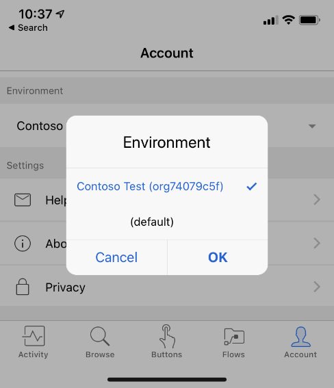
    
8.  Select **Approvals** in the upper right and view all pending approvals.
    
    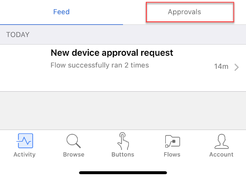
    
9.  You can quickly approve or reject these pending requests from this screen.
    
10.  If you have push notifications turned on and you're signed in to the flow mobile app, when you receive a new approval request, it triggers a push notification on your phone. Try out this functionality.
    

Summary
=======

Power Automate cloud flows allow you to quickly add automation such as automated approvals. In this module, you built and tested approval flows for Contoso Coffee's ordering applications.

###  Congratulations, you've successfully completed this lab. You've created your Power Apps application and flow, and you've connected them to a Microsoft Dataverse table. Now, you're ready to build your own apps and workflows.